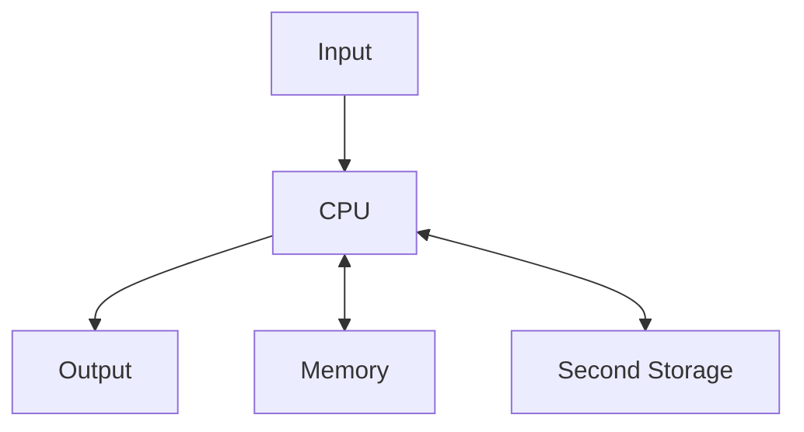

To interact with any web API in Node-RED, you can use `http request` block(node) to fetch or post data and process it in a function block.


Traditional computer architecture



IoT computing architecture [^1]

```mermaid
graph TD
Input[IoT Sensor] -> Computing[Cloud computing]
Computing --> Output[IoT Trigger]
Computing <--> Storage[Cloud Storage]
```


[^1] http://www.slideshare.net/williamwyliang/the-development-trends-of-smart-applications-and-open-source-system-software-during-the-past-few-years-for-ntu-csie-2017-01

## Solicity

https://monax.io/docs/tutorials/solidity/

https://learnxinyminutes.com/docs/solidity/

以現實生活為例，我們日常生活所需，還必須透過「交易」來滿足。從簡單到買一份早餐，我們都循著「訊息 - 信任 - 價值」的路徑來達成和早餐店老闆的交易。

首先，早上要先想好打算吃什麼早餐，哪家早餐有提供想吃的早餐種類（訊息），選好早餐店與點餐後（信任），完成付帳並拿到餐點（價值）。

那麼，如果我們打算把這個過程搬上網，把實體物品換成虛擬物品呢？


# port web extension

https://developer.mozilla.org/en-US/Add-ons/WebExtensions/Porting_a_Google_Chrome_extension

https://github.com/mozilla/webextension-polyfill

https://developer.mozilla.org/en-US/Add-ons/WebExtensions/Getting_started_with_web-ext

web-ext run --firefox=/Applications/FirefoxNightly.app/Contents/MacOS/firefox


## Knowledge Graph
LevelGraph

## Machine Learning

ML如何入門?

1. https://www.coursera.org/learn/machine-learning
2. http://course.fast.ai
3. https://www.deeplearning.ai


如何比较Keras, TensorLayer, TFLearn ？
https://www.zhihu.com/question/50030898

TensorFlow如何入門?
https://www.zhihu.com/question/49909565

http://bangqu.com/181i1U.html


"你吃了這些藥有1%的機率會中獎喔"
要不要搏幾把？如果你了解ICO，也很看好ICO這種投資方式，可以酌量根據自己的財力來參與，但別在還搞不清的狀況下賭身家。
在這上面賭身家，就像醫師在你決定開始吃這些藥後才改跟你說"你病後的五年存活率有1%喔"，想必心都涼了吧。


可更新合約的架構思路
https://ethereum.stackexchange.com/questions/2404/upgradeable-smart-contracts

upgradable
https://gist.github.com/Arachnid/4ca9da48d51e23e5cfe0f0e14dd6318f

https://github.com/ConsenSys/smart-contract-best-practices

合約本身部署了就不能更改，但可以透過　entryway contract / ENS　更新對應的合約位址。

部署註冊合約 --> 取得註冊合約位址
--> 將註冊合約位址寫入後端合約
--> 部署後端合約 --> 取得後端合約位址
--> 將後端合約位址寫入註冊合約

當前端合約需要呼叫後端合約時，改透過註冊合約取得後端合約的位址。

或將邏輯寫在library中並透過DELEGATECALL/CALLCODE呼叫，這樣資料都還是存在合約中。缺點是ABI(程式公開介面)不能改

ETH ERC-20

[How to create a Token Factory with Ethereum — Part 1](https://hackernoon.com/how-to-create-a-token-factory-with-ethereum-part-1-85e84d1f38fc)

# Getting Start your first smart contract

<!-- $ npm install -g embark ethereumjs-testrpc
$ embark sample
$ cd sample
$ embark simulator -->

/Applications/Mist.app/Contents/MacOS/Mist --rpc localhost:8545


5
in another console

$ embark run

best practices
https://github.com/ConsenSys/smart-contract-best-practices

slide
http://slides.com/ming-derwang/solidity-tutorial-6-37-38-54#/11

## DAPP與Web的交集

* Merkle Patricia tree/trie https://github.com/ethereum/wiki/wiki/Patricia-Tree
* RLP https://github.com/ethereum/wiki/wiki/RLP


https://medium.com/@mvmurthy/full-stack-hello-world-voting-ethereum-dapp-tutorial-part-2-30b3d335aa1f

* Merkle Patricia tree/trie (MPT) 存储所有账户状态，以及每个区块中的交易和收据数据
* Recursive Length Prefix(RLP): 序列化格式
* REMIX IDE https://remix.ethereum.org/


https://codetract.io/


currency
voting
Auction
DAO
store data


### 加入數值計算方法

我們在`HelloWorld.sol`中再加入一個sum方法，將傳入的兩個數字加總並回傳。

```
function sum(uint8 a, uint8 b) returns (uint8) {
  return (a + b);
}
```

這邊用`uint8`表示支援輸入8bit整數。

```sh
$ truffle compile
...
$ truffle migrate --reset
...
$ truffle console
> let contract
> HelloWorld.deployed().then(deployed => contract = deployed)
> contract.sum.call(1, 2)
{ [String: '3'] s: 1, e: 0, c: [ 3 ] }
```

看來結果正確。

### ...真的正確嗎?

我們接續前面開著的`truffle console`繼續輸入
```
> contract.sum.call(255, 23)
{ [String: '22'] s: 1, e: 1, c: [ 22 ] }
> contract.sum.call(1, -3)
{ [String: '255'] s: 1, e: 2, c: [ 255 ] }
> contract.add.call("a", -2)
BigNumber Error: new BigNumber() not a number: a
...
```
剛剛寫的sum方法其實不堪一擊。


繼續看 http://truffleframework.com/tutorials/pet-shop 範例

// It is a good guideline to structure functions that interact
// with other contracts (i.e. they call functions or send Ether)
// into three phases:
// 1. checking conditions
// 2. performing actions (potentially changing conditions)
// 3. interacting with other contracts

// If these phases are mixed up, the other contract could call
// back into the current contract and modify the state or cause
// effects (ether payout) to be performed multiple times.
// If functions called internally include interaction with external
// contracts, they also have to be considered interaction with
// external contracts.

* The Hitchhiker’s Guide to Smart Contracts in Ethereum https://blog.zeppelin.solutions/the-hitchhikers-guide-to-smart-contracts-in-ethereum-848f08001f05
* https://amisamity.github.io/contract-training/
* Robust Smart Contracts with OpenZeppelin http://truffleframework.com/tutorials/robust-smart-contracts-with-openzeppelin
* http://zeppelin-solidity.readthedocs.io/en/latest/getting-started.html

Mist Browser

Mist-installer-x.x.x
https://github.com/ethereum/mist/releases

or Parity
https://parity.io/parity.html

https://geth.ethereum.org/downloads/

truffle + webpack
http://truffleframework.com/tutorials/bundling-with-webpack

testnet

// $ truffle migrate --network production
$ geth attach
> personal.unlockAccount(eth.coinbase)


CrowdSale

* What is an Initial Coin Offering? https://www.youtube.com/watch?v=iyuZ_bCQeIE


https://drive.google.com/file/d/0ByMtMw2hul0EN3NCaVFHSFdxRzA/view

https://cdn-images-1.medium.com/max/1600/1*wOcHbpZ25WbtWWsGI2b1Kw.png

Solidity CRUD
https://medium.com/@robhitchens/solidity-crud-part-1-824ffa69509a

Solidity CRUD 2
https://medium.com/@robhitchens/solidity-crud-part-2-ed8d8b4f74ec


## Node Red Bot
$ sudo npm install -g --unsafe-perm node-red
$ cd ~/.node-red
$ npm install node-red-contrib-chatbot
$ node-red

https://gist.github.com/murrion/c428696635b535e68747

```
Bugs filed 	631
Comments made 	7584
Assigned to 	509
Commented on 	2049
Patches submitted 	461
Patches reviewed 	256
Bugs poked 	2605

Statuses changed 	RESOLVED (964), FIXED (436), VERIFIED (0), INVALID (36)

Activity by product
Firefox OS (12969), Firefox (6408), Toolkit (243), Core (154), Invalid Bugs (100), Testing (30), Firefox for Android (19), L20n (18), www.mozilla.org (12), mozilla.org (11), Mozilla Localizations (9), Release Engineering (9), B2GDroid Graveyard (7), mozilla.org Graveyard (6), bugzilla.mozilla.org (6), Marketplace (4), Other (75)
```

## 錢包分類

網頁版錢包
- MyEtherWallet
瀏覽器/插件錢包
 - Mist
 - Parity
 - Ethereum Wallet
 - MetaMask
手機版錢包
 - imToken
 - toshl
 - status.im (alpha)
硬體錢包
- ledger nano S
- trezor
交易所錢包


Node
light

## 切換到公開測試網路

## 取得測試用 Ether

The easiest way to get some testnet ether is via https://faucet.metamask.io/

```
npm install -g solium
solium --init
solium -d contract/
```

## Mist + geth

get Mist-linux64-0-9-3.deb from github(not Ethereum-Wallet) and install it
https://github.com/ethereum/mist/releases/

$ geth --datadir=./chaindata init ./genesis.json
$ geth --datadir=./chaindata

$ ethereumwallet --args --rpc /home/gasolin/Documents/idv/geth/chaindata/geth.ipc

creaete account

$ geth attach <path to ipc>.ipc

> miner.start(1)
// wait until DAG generated
> miner.stop()

https://github.com/ethereum/mist/wiki#bind-address-already-in-use

truffle-builder
https://github.com/trufflesuite/truffle-default-builder
http://truffleframework.com/docs/advanced/build_processes

var DefaultBuilder = require("truffle-default-builder");
module.exports = {
  build: new DefaultBuilder(...) // specify the default builder configuration here.
}


> truffle(development)> web3.eth.accounts

debug <transaction id>

> web3.eth.sendTransaction({to: web3.eth.accounts[1], from: web3.eth.accounts[0], value: web3.toWei(3, "ether")})

Send to account or contract

## handle ether in contract

payable

https://programtheblockchain.com/posts/2017/12/15/writing-a-contract-that-handles-ether/

https://programtheblockchain.com/posts/2017/12/26/checking-the-sender-in-a-smart-contract/


Emoji Chart of Life

Yearly Emoji Chart


Life

```
 0 👶 👧 🍼 🍼 🚚 🔸 🔸 🚚 🤧 ✈️
10 🔸 🔸 🔸 🎒 🔸 🔸 🎒 🔸 🔸 🎒
20 🌐 🔸 🎓 🔸 🎓 👔 🗣 🗣 📗 👔
30 ☁️ 👔 📙 📱 🛠 🦊 📘 🔸 🔸 🔸
   🔸 🔸 🔸 🔸 🔸 🔸 🔸 🔸 🔸 🔸
   🔸 🔸 🔸 🔸 🔸 🔸 🔸 🔸 🔸 🔸
   🔸 🔸 🔸 🔸 🔸 🔸 🔸 🔸 🔸 🔸
   🔸 🔸 🔸 🔸 🔸 🔸 🔸 🔸 🔸 🔸
   🔸 🔸 🔸 🔸 🔸 🔸 🔸 🔸 🔸 🔸
```

Career

```
 0 👶 🔸 🔸 🔸 🔸 🔸 🔸 🔸 🔸 🔸
10 🔸 🔸 🔸 🎒 🔸 🔸 🎒 🔸 🔸 🎒
20 🌐 🔸 🎓 🔸 🎓 👔 🗣 🗣 📗 👔
30 ☁️ 👔 📙 📱 🛠 🦊 📘 🔸 🔸 🔸
   🔸 🔸 🔸 🔸 🔸 🔸 🔸 🔸 🔸 🔸
   🔸 🔸 🔸 🔸 🔸 🔸 🔸 🔸 🔸 🔸
   🔸 🔸 🔸 🔸 🔸 🔸 🔸 🔸 🔸 🔸
   🔸 🔸 🔸 🔸 🔸 🔸 🔸 🔸 🔸 🔸
   🔸 🔸 🔸 🔸 🔸 🔸 🔸 🔸 🔸 🔸
```

Family

```
 0 👶 👧 🍼 🍼 🚚 🔸 🔸 🚚 🤧 ✈️
10 🔸 🔸 🔸 🎒 🔸 🔸 🎒 🔸 🔸 🚋
20 👻 🔸 🎓 🔸 🚚 🔸 🔸 🤢 🔸 👰
30 👦 👦 🔸 🔸 🚚 🔸 👻 🔸 🔸 🔸
   🔸 🔸 🔸 🔸 🔸 🔸 🔸 🔸 🔸 🔸
   🔸 🔸 🔸 🔸 🔸 🔸 🔸 🔸 🔸 🔸
   🔸 🔸 🔸 🔸 🔸 🔸 🔸 🔸 🔸 🔸
   🔸 🔸 🔸 🔸 🔸 🔸 🔸 🔸 🔸 🔸
   🔸 🔸 🔸 🔸 🔸 🔸 🔸 🔸 🔸 🔸
```

Simple:

* any markdown editor can create well crafted emoji of life chart, ex: http://jbt.github.io/markdown-editor/


yearly

Create emojiof.life website to promote the idea


# bullet-journal

https://www.pinkoi.com/magz/hETcQRFg

https://www.buzzfeed.com/nicolenguyen/genius-ways-you-can-customize-your-bullet-journal

https://www.dropbox.com/s/7jdaj1rw6utnt6g/Bullet%20Journal%20Reference%20Guide%E4%B8%AD%E5%9B%BD%E8%AA%9E.pdf?dl=0


var instance
Payback.deployed().then((ins) => instance = ins);
instance.validDeposit(web3.eth.coinbase, web3.toWei(2, 'ether'), {from: web3.eth.coinbase, to: instance.address, value: web3.toWei(2, 'ether')})


var SapienTokenAddress = "0x9857D34e0a3Ea34518E6BC54eA32cfF544BA54b7"

var SapienTokenABI = [{"constant":true,"inputs":[],"name":"name","outputs":[{"name":"","type":"string"}],"payable":false,"stateMutability":"view","type":"function"},...]

var SapienTokenBytecode = "6060604...."

var spnCoinContract = web3.eth.contract(SapienTokenABI).at(SapienTokenAddress);

資訊就在網上，只要上網，隨時可以找出來用 -->
所以重要的是，了解找資料或關鍵字的方式。

--> 只要記住搜尋方法，想要的資訊隨時能到手。
而對自己是絕對必要的資訊，則必須「當作知識加以記憶」


整理想法的意義

人生要過得快樂且有所收穫，就無法盡做自己喜歡的事情。
人應設法去接納，喜歡那些為了生活，工作而不得不去做的事。

不是將不得不做的事視為「義務」，視為「為了實現夢想必要的過程 」--> 先將自己的夢想與想法，條列式的寫出來


## emoji changelog

commitzen
https://github.com/commitizen/cz-cli

Commitizen adapter for gitmoji
https://www.npmjs.com/package/cz-gitmoji

or 

https://github.com/wldcordeiro/cz-gitmoji-changelog

standard version
https://github.com/conventional-changelog/standard-version

git cz + npm run release

"config": {
  "commitizen": {
    "path": "cz-gitmoji-changelog"
  }
},

commitizen init cz-gitmoji-changelog --save-dev

https://egghead.io/series/how-to-write-an-open-source-javascript-library


## Developer tools

## Record the screen

Peek & obs
open boradcast

### Ubuntu Make

https://www.jianshu.com/p/58cbf56b4a55

### NVM

https://github.com/creationix/nvm

# curl -o- https://raw.githubusercontent.com/creationix/nvm/v0.33.8/install.sh | bash


# Android on Linux via Ubuntu Make

umake (Ubuntu Make)


```
code ~/.bashrc
```

```
export ANDROID_HOME=$HOME/.local/share/umake/android/android-sdk
export PATH=$PATH:$ANDROID_HOME/tools
export PATH=$PATH:$ANDROID_HOME/platform-tools
```


## Docker

sudo add-apt-repository "deb [arch=amd64] https://download.docker.com/linux/ubuntu xenial stable"

https://docs.docker.com/engine/installation/linux/docker-ce/ubuntu/#install-docker-ce

https://www.digitalocean.com/community/tutorials/how-to-install-and-use-docker-on-ubuntu-16-04

https://blog.gtwang.org/virtualization/ubuntu-linux-install-docker-tutorial/


## 參考資料

* ubuntu-make | Ubuntu Linux一键安装开发环境 https://www.jianshu.com/p/58cbf56b4a55
* 2 Ways to Install Android Studio in Ubuntu 16.04 and Ubuntu 17.10 https://www.linuxbabe.com/ubuntu/install-android-studio-ubuntu-16-04


Jest snapshot testing
https://facebook.github.io/jest/docs/en/snapshot-testing.html

Redux action & reducer unit testing


[Redux unit testing with Jest](https://hackernoon.com/redux-unit-testing-with-jest-f3a18f387f75)
not cover reducer with state test

[Unit Testing Redux Connected Components](https://hackernoon.com/unit-testing-redux-connected-components-692fa3c4441c)

[Redux Writing Tests](https://github.com/reactjs/redux/blob/master/docs/recipes/WritingTests.md) with redux-thunk (function)

https://medium.com/@bezgachev/6-simple-steps-to-automatically-test-and-deploy-your-javascript-app-to-github-pages-c4c32a34bcb1


yarn test --coverage

jest mock observable
https://facebook.github.io/jest/docs/en/es6-class-mocks.html#replacing-the-mock-using-mockimplementation-jest-docs-en-mock-function-apihtml-mockfnmockimplementationfn-or-mockimplementationonce-jest-docs-en-mock-function-apihtml-mockfnmockimplementationoncefn


## Deploy create-react-app to github page via Travis CI

[Building and Deploying a React Create App to GitHub Pages Using TravisCI](http://rants.broonix.ca/building-and-deploying-a-react-create-app-to-github-pages-using-travisci/)
[6 simple steps to automatically test and deploy your JavaScript app to GitHub Pages](https://medium.com/@bezgachev/6-simple-steps-to-automatically-test-and-deploy-your-javascript-app-to-github-pages-c4c32a34bcb1)

test (node_module) import fix https://github.com/babel/babel/issues/5593


smooth scrolling
https://css-tricks.com/snippets/jquery/smooth-scrolling/

# 我的筆記工具

* 附夾鍊袋的 25k 筆記本 - 雙手帳夾鍊書衣

夾鍊袋中裝的東西：
* Pilot Fuxion 魔擦筆 (藍)
* Pilot Fuxion 魔擦筆 (螢光藍)
* Pilot HI-TEC-C 雙色 (紅/綠)
* 五彩索引片
* 模板尺

書籤

https://world.taobao.com/item/529101943764.htm?spm=a312a.7700714.0.0.2bd44fb7j2AfDX#detail

* 立可得 快印


ethjs
mascara https://github.com/sulliwane/mascara

QRCode https://chart.googleapis.com/chart?chs=150x150&cht=qr&chl=123

Plotting Libraries
https://medium.com/@mtiller/open-source-plotting-libraries-primarily-for-react-c43cfa4dc90f

## React storybook
https://storybook.js.org/basics/guide-react/

Cross Platform Web/Mobile service expert. Open source contributor.

I'd like to leverage my ability to do good for people.
Make people in my range of influence living better and happy.

Specialties: Web development
Tech writing and presentation
Architect and develop Cross Platform (Web server-mobile) integration Service
Network Protocols
Android mobile development
I *can* do Firmware integration but prefer not to


https://stackoverflow.com/questions/13855463/bash-mkvirtualenv-command-not-found

sudo apt-get install python-pip
sudo pip install virtualenv
sudo pip install virtualenvwrapper
set .bashrc


sudo pip install "docker<3.0" docker-py docker-compose

## web extension with create-react-app
https://codepen.io/supernova_at/post/creating-a-browser-extension-with-create-react-app


## ABI

https://medium.com/taipei-ethereum-meetup/ethereum-%E6%99%BA%E8%83%BD%E5%90%88%E7%B4%84%E9%96%8B%E7%99%BC%E7%AD%86%E8%A8%98-%E6%B7%B1%E5%85%A5%E6%99%BA%E8%83%BD%E5%90%88%E7%B4%84-abi-268ececb70ae


Web engineer and open source contributor with 10+ years of experience. Consistently explore web/mobile technologies and improvement of every aspect of <a href="http://gasolin.idv.tw/portfolio">bootstrapping</a> and <a href="http://gasolin.idv.tw/present">onboarding</a> process.
    In doing so, I can encourage developers and users by providing a user engaging interface, well-documented project or crafted presentation.</p>
    <p>12+ years in Internet industry as frontend, mobile app, backend, network system integration engineer helps me put myself in other's shoes and make cross-functional cooperation smoothly 🌐.
    The multi-position experience also helps me crossing the border to come out some integration projects and bring innovation 💡 into involved projects.</p>
    <p>Previously worked in Mozilla as a <a href="https://wiki.mozilla.org/index.php?title=Modules%2FFirefox&diff=1177818&oldid=1163663"> Firefox</a>  🔥🦊 and <a href="http://firefox-dev.tools/">Devtools</a> 👨‍💻 module peer for 5 years, be a volunteer organizer in <a href="https://www.facebook.com/groups/1614248835348810/?fref=ts">GDG Taipei</a> for 8 years, and published <a href="portfolio#books">a best selling Android development book 📗</a> in 2011.</p>
    <p>The most popular open source project I created is <a href="https://github.com/BlocklyDuino/BlocklyDuino">BlocklyDuino</a>,
    which has been used by several <a href="https://github.com/MediaTek-Labs/BlocklyDuino-for-LinkIt">Arduino-compatible boards</a> and STEM projects.
    Currently I'm working on an eBook 📘 about <a href="https://gasolin.gitbooks.io/learn-ethereum-dapp/">programming Smart Contract and DApp</a>.</p>

Develop Firefox Desktop frontend & Devtools

Achievements:
.Firefox module peer, Devtools module peer
.Deliver photon onboarding tours at newtab page
.Planned and Rewrote Network Monitor(Devtools) with React and Redux

Development of Firefox OS Build-in Apps (Gaia)
Evangelize 'web as platform' to mobile developers.

Achievements:
.Gaia::Settings peer
.Solving issues to bring first Firefox OS device on Market.
.Implement first Firefox OS  runtime customization for each region/carriers
.COSCUP hands on for offline web app development
.Make Firefox OS tablet from demo to developer build

* Design&Implement modern web user interface and related API for the cloud storage system. With Django, Twitter Bootstrap, jQuery and OpenStack.
* Bring Continue Integration (unit test, daily-build) into existing development environment. With Jenkins and VirtualBox.
* Facilitate the collaboration among UX designer, Web developer and software developer

Paperless environment related research and development
. Architect and implement education related services, include cross platform UX, web frontend, Database, API, and mobile clients.<br/>
. Architect and Lead 2~7 members to develop Web and Mobile integration service.
. Designed, coded and tested e-publish system with digital right management (DRM) support.
. Develop multiple DRM clients (with Java/C/Qt) applicable for win/mac/linux/embedded OS.
. Trained and submitted an Intellectual Property(IP) claim.


Designed, coded, ported and tested on linux-based home networking ODM products for JP and US customers.
Made wire and wireless router firmware development from backend to frontend (system build/porting, iptable routing, user space application, web GUI).
Researched and ported emerging network protocols (such as IPv6 6to4, Tunnel Broker(OCN), DTCP(Feel6), Microsoft LLTD and some private protocols) onto embedded CPE devices.


使用 npx


get rinkeby testnet ether from
https://faucet.rinkeby.io/

play with
http://aragon.aragonpm.com/#/

multiseg
http://aragon.aragonpm.com/#/gastest.aragonid.eth

democrocy


http://truffleframework.com/tutorials/using-infura-custom-provider

共通點為 JSON ABI file

https://developer.mozilla.org/en-US/Add-ons/WebExtensions/Chrome_incompatibilities


Gitcoin
MetaMask
Ethfinex (Netcar): developing a fully scalable and community owned decentralised exchange
Aragon (DNT): Decentralize Org
Polkadot/tindermint multi-chain

Giveth https://giveth.io/
reward DAO https://wiki.giveth.io/dac/contributors-guide/
Communities (DACs), Campaigns and Milestones
 https://medium.com/giveth/what-is-the-future-of-giving-d50446b0a0e4

MiniMe + ERC223 -> Yoga token


giveth-dapp:

web3 1.x + bignumberjs
react-input-token


User1 -- MyUSD token --> Contract
Contract add func
User2 -- ETH --> Contract
func called
oracle call to fetch rate

eth with fetched rate to User1
MyUSD + remaining ETH to User2


MyUSD

Contract flattener
https://github.com/poanetwork/solidity-flattener


境外所得
https://www.cmoney.tw/notes/note-detail.aspx?nid=29806

個人海外所得課稅說明
http://www1.jihsun.com.tw/Office/overseas.htm

英文戶籍謄本
http://hclovenote.blogspot.tw/2016/03/2016-03-15.html

公會
http://nettech.23213799.com.tw/joinus.php

Bitfinex 介紹
https://www.blocktempo.com/%E5%A6%82%E4%BD%95%E5%9C%A8%E4%BA%A4%E6%98%93%E6%89%80%E5%85%A5%E9%87%91-bitfinex%E5%85%A8%E6%94%BB%E7%95%A5%E6%95%99%E5%AD%B8%EF%BC%81part-01/


tradding bot: 24hr market
- gecko
- not a high-frequency trading bot (> 1min)
Market data -> candles (OHLC, VWP, amount of trades)
Strategies -> candles + indicator values go in => signals come out

Bitfinex從註冊到入金
https://www.blocktempo.com/%E5%A6%82%E4%BD%95%E5%9C%A8%E4%BA%A4%E6%98%93%E6%89%80%E5%85%A5%E9%87%91-bitfinex%E5%85%A8%E6%94%BB%E7%95%A5%E6%95%99%E5%AD%B8%EF%BC%81part-01/

在家辦公沒你想得那麼簡單
https://cn.nytimes.com/education/20170927/work-at-home-tips-advice/zh-hant/

今天找不到借書證所以沒拿到書:(
忿而寫了個圖書證號小工具。這樣以後用手機打開書籤網頁就可以刷，不怕忘了帶借書證了。
(只測過台北市的，歡迎其他地方的朋友回報能不能用)

1. 連到 https://gasolin.github.io/librarycard?id=圖書證號 (把網址列中`?id=`後的`圖書證號`改成自己真的圖書證號碼，通常是身份證號後再加2位序號)
2. 將此網址設為書籤，以便之後再次使用
3. 如果你覺得這樣很方便，請將以上網址和使用方式分享給你的朋友。
4. 本工具完全開源，且不會紀錄使用者資訊。歡迎前往https://github.com/gasolin/librarycard 專案查看。


* 醒醒吧，帶台電腦就能闖天下的「數位遊民」只是神話一場
數位遊民 != 遠端工作
https://www.inside.com.tw/2017/03/31/digital-nomad-is-just-a-myth

NIST Blockchain Technology Overview
https://csrc.nist.gov/CSRC/media/Publications/nistir/8202/draft/documents/nistir8202-draft.pdf


web extension

https://medium.com/@gilfink/building-a-chrome-extension-using-react-c5bfe45aaf36

fox: https://www.techiediaries.com/developing-firefox-extensions-with-webextension/

CSS perf advice
http://johnotander.com/css/2015/06/10/css-performance/
