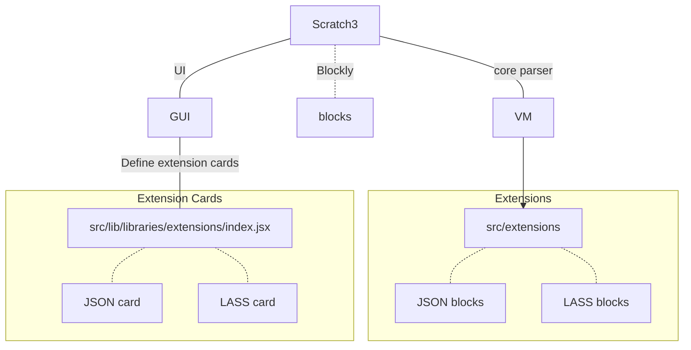

## Scratch3 擴充套件開發

最近應 s4a 社群許老師的邀請，在業餘時間研究了一下 Scratch 3，看看能做點什麼貢獻。

Scratch 3 是一套由麻省理工學院（MIT）發起，以兒童學習程式為目的所設計的視覺化編程軟體。Scratch 3 可使用堆疊積木塊的方式，來完成一般程式語言能完成的事情。

Scratch 3 除了程式語言的部分採用堆疊積木塊的方式，還提供了對應的整合的舞台，主角，並提供相對應的積木塊。你可以透過拖拉積木塊，直接控制這些主角在場景中的活動。

Scratch 3 的積木編程部分和我多年前玩過[^1]的 [Blockly](https://developers.google.com/blockly/) 很相似。實際上 [Blockly](https://developers.google.com/blockly/) / [AppInventor](https://appinventor.mit.edu/) 的靈感來源就是來自於 Scratch。

在 Scratch 3 版本中，也已經將 Blockly 整合進去, 作為它提供程式積木的方式。

我做了JSON抓取資料並解析，和空污LASS的擴充套件。透過這些積木，學生可以從網路上抓取最新的空氣污染狀況，然後用 Scratch 3 上場景可愛的人物口中說出來，或是視覺化的顯示結果。

例如透過JSON積木，連線到`http://ifconfig.me/all.json`取得對外的 IP

或是透過填入設備代號，連到任一 LASS 設備，取得當地PM2.5，溫度等資訊

由於 Scratch 3 尚未完成第三方擴充套件的分享架構，因此這兩個擴充套件都放在 `scratch3-internet`[^2] 專案中，想嘗試的人也可以直接連到[^3]使用。

`scratch3-internet`[^2] 專案的特色，是簡化了擴充套件開發前的設定工作，並很容易部署到 Github 網頁上。

技術上，`scratch3-internet`[^2] 專案用了 git submodule 來抓取 Scratch 3 的相關專案，並透過patch的方式將自行開發的擴充套件加入其中，最後包裝成自己的版本[^3]。透過這種方式最小化維護成本。

擴充套件需修改的部分如下（可在[^2]中找到更詳細的文件）：

要啟動一個適合擴充套件開發的 scratch3 專案，只要照以下步驟即可：

1. fork scratch3-internet 專案
1. clonse repo `git clone https://github.com/[your name]/scratch3-internet.git`
1. get and setup related projects `npm run setup`
1. start the development server `npm run start`

要部署到自己的 Github 專案網頁，只需

1. 編譯網站，`npm run build`，編譯好的檔案在 `scratch-gui/build`
1. 部署到 Github 專案網站的 `gh-pages` 分支中 `npm run deploy`，即可透過 `https://[yourname].github.io` 存取。

## 參考資料

- [1] 以前做的 Blockly + Arduino 專案 [BlocklyDuino](https://github.com/BlocklyDuino/BlocklyDuino)
- [2] https://github.com/gasolin/scratch3-internet
- [3] Scratch 3 editor http://gasolin.idv.tw/scratch3-internet/
- [4] Scratch 3 內建積木說明 https://en.scratch-wiki.info/wiki/Blocks
- [5] 如何定義 Blockly 積木 https://developers.google.com/blockly/guides/create-custom-blocks/define-blocks
- [6] Scratch 3.0 学习笔记 https://github.com/Micircle/scratch3.0-note
- [7] How to Develop Your Own Block for Scratch 3.0 https://medium.com/@hiroyuki.osaki/how-to-develop-your-own-block-for-scratch-3-0-1b5892026421
- [8] 开发一个 Scratch3 Extension https://wiki.huangyang.me/post/2019-03-13-scratch3-extension
- [9] Scratch 3.0 Extensions https://github.com/LLK/scratch-vm/blob/develop/docs/extensions.md
