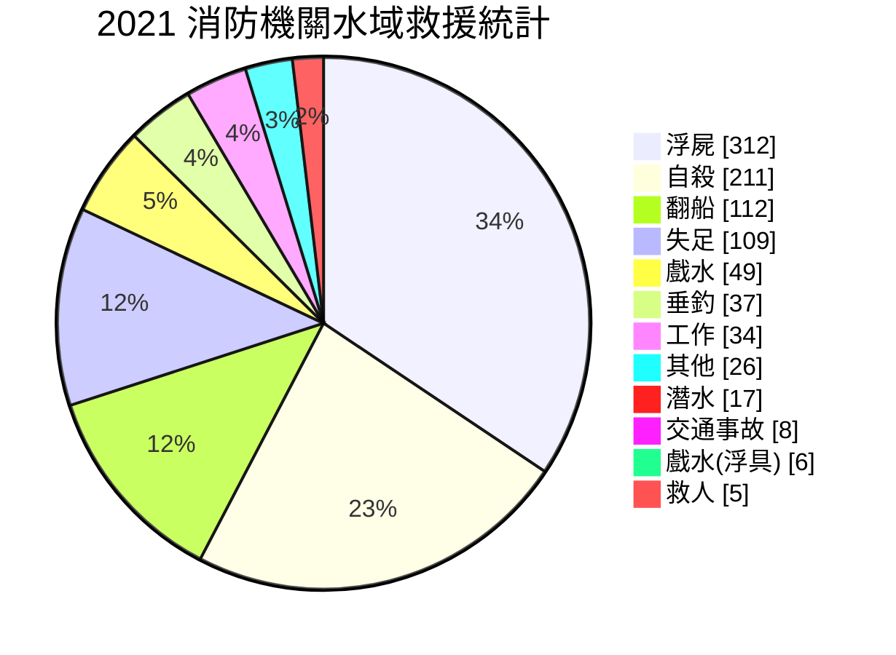
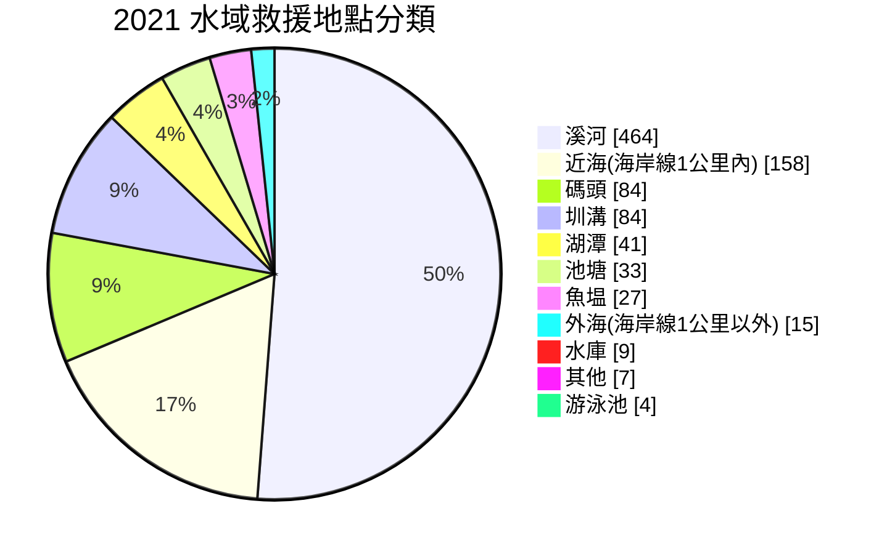

最近天氣炎熱。到水邊消消暑是很熱門的選擇。但是隨之而來在水域活動發生意外，而需出動救援的新聞也層出不窮。我很好奇到底是怎麼樣的狀況需要出動水域救援？救援的結果如何？使用 SUP/獨木舟這樣的浮具親水，是否一樣危險？

於是我找到了[政府開放資料平台](https://data.gov.tw/dataset/7065)上的「消防機關水域救援統計」。這邊可以取得各年份的救援統計資料。目前最新的資料只更新到 2021 年份，因此使用此資料進行統計（注意這份統計資料呈現的是在政府 2020 後宣告開放山林海域的狀況）。
（因為使用的圖表問題，手機版網頁需要橫著看，才會顯示分類細目。）

<!-- truncate -->

## 水域救援統計

2021 這一年總共有 926 人次的救援紀錄，共 357 人獲救，其他都是失蹤或死亡。水域救援相對山林救援（生存率有 90% 以上）來看，，生存率只有相當低的 38.5% 😱......嗎？

可以看到水域救援裡「浮屍」、「自殺」佔了超過一半的水域救援比例。
「浮屍」(34%) 312 位是死透了，也沒辦法分辨具體原因；「自殺」(23%) 者有 100 位死亡或失蹤，111 位獲救。

最常出事的水域地點為溪河(50%)、近海(17%)、碼頭(9%)，與圳溝(9%)。碼頭(9%)占的出事比率讓我感到意外。

## 出事類型分析

若我們把歸因不明的「浮屍」、和動機不純（不是來親水）的「自殺」者排除，得到的會是比較能進一步分析水域危險原因的圖表。

「翻船」(112人)、「失足」(109人)佔了救援人數的多數。戲水(49人) + 戲水(浮具)(6人)在後。

|翻船 | 人數 |
|-----|---|
|失蹤 | 2 |
|死亡 | 4 |
|獲救 | 106 |

「翻船」的死亡率和平均值相較極低，可以想見出海的船家相較之下有充足的預期與安全準備。

|失足 | 人數 |
|-----|---|
|失蹤 | 4 |
|死亡 | 59 |
|獲救 | 46 |

「失足」的獲救率 42%，比自殺還低。可能是因為自殺是有意識的行為，失足則是預期之外。

|戲水 | 人數 |
|-----|---|
|失蹤 | 1 |
|死亡 | 24 |
|獲救 | 24 |

戲水出事的獲救率有近 50%。

值得一提的是使用浮具戲水的 6 位全數獲救，因此獨立出來分一類。

那麼死亡率最高的是什麼？是「交通事故」(死亡7/獲救1)，這些人也是預期之外的掉入水中，而且事情發生前應該就有些問題。

## 我的解讀

簡單的總結一下：水域有風險，特別是對那些不以為意的人而言。
即使有意親近水域，出意外時的生還率仍然只有近 50%，但是如果有攜帶浮具（救生衣、船隻或槳板）或船員指導，可以進一步大幅提高生存率。

穿著浮具、帶好裝備，跟著熟悉當地水域的教練親水，可以保障活動的安全。若沒有教練帶也要相伴而行，並需要具備判斷水域狀況的能力，才能保障自己的生命安全。

## 參考資料

- 本篇文章使用的[資料與分析表格](https://docs.google.com/spreadsheets/d/1FtZx5Pby9J0XeHCo1qMAekHoQQqeNXlsUCy4By7Iphk/edit?usp=sharing)(Google Spreadsheets)
- [107年山難237件、溺水907件 內政部提醒做好事前準備](https://www.moi.gov.tw/News_Content.aspx?n=2&s=13799)
- [消防署近5年(105年至109年)水域事故救援統計資料](https://www.nfa.gov.tw/cht/index.php?code=list&flag=detail&ids=969&article_id=10845)
