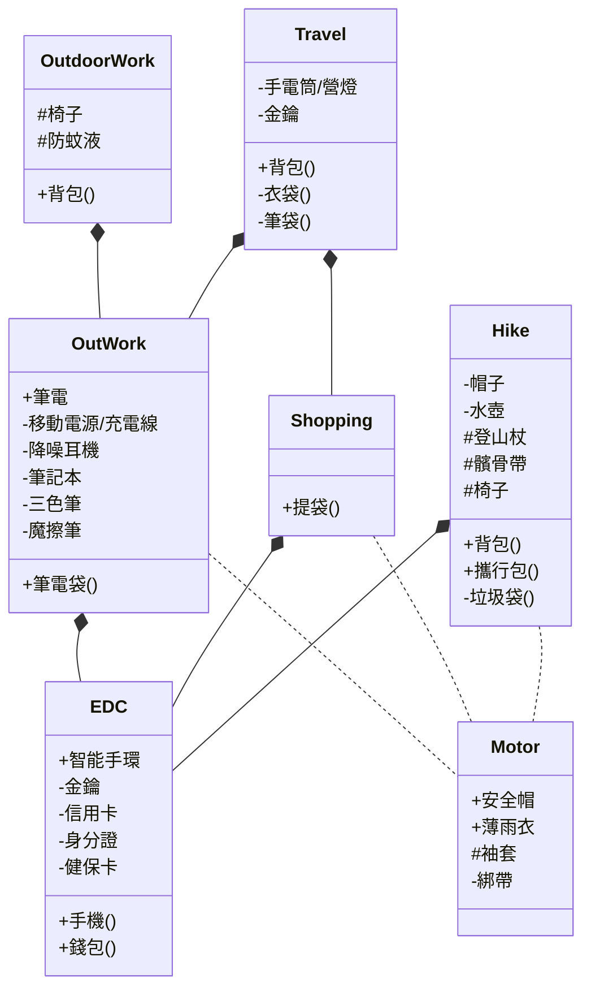

年中的時候嘗試爬了鯉魚山（小百岳）。在開始登山的過程中，發現前往較嚴苛的環境時，除了要考慮帶什麼，也需要考慮怎麼攜帶。

亦即出門時不僅只需要有個列表，確認有帶到東西而已，而是需要在減輕負荷與安全舒適之間的權衡，並考慮攜帶的方式（使用什麼容器）。這似乎和 EDC (Every Day Carry，~~日常工具~~日常攜帶品) 的概念相符，也和我持續紀錄多年的「個人工具箱」系列合拍。

打造適合自己的「日常攜帶品」組合是持續的過程，可以透過思考，設計，達到當時的最適效果。讓每次生活/出行時，因為身邊被喜愛的事物環繞而充滿愉悅。

<!-- truncate -->

除了列表形式，我嘗試使用UML圖將身邊的工具關聯起來，分成日常攜帶(EDC)、外出工作（OutdoorWork）、戶外工作（OutdoorWork）、購物、騎車、登山等類別。

以上是我目前的日常工具UML圖

## 說明

透過 [Mermaid.js](https://mermaid-js.github.io/mermaid-live-editor/)線上編輯器可以很容易地透過定義 class 的方式來製作 UML class 圖。格式可參考 https://mermaid-js.github.io/mermaid/#/classDiagram

透過 *-- 定義不同群組間的關聯

```
classDiagram
OutWork *-- EDC
Shopping *-- EDC
Hike *-- EDC
```

並賦予 visibility 標示符號新的定義
- `包包()`表示使用的攜行容器
- `+筆電`表示將長時間拿出來使用的物品
- `-筆記本`表示放在袋內的物品
- `#椅子`表示可選項（看狀況攜帶）
