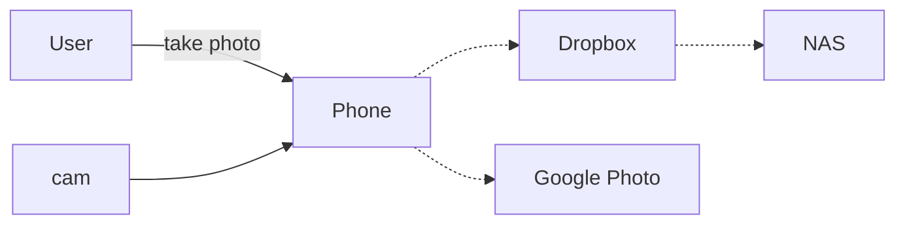
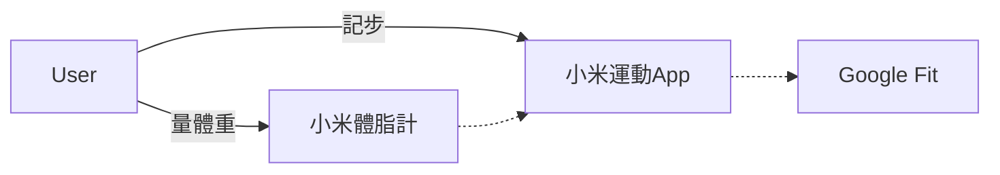
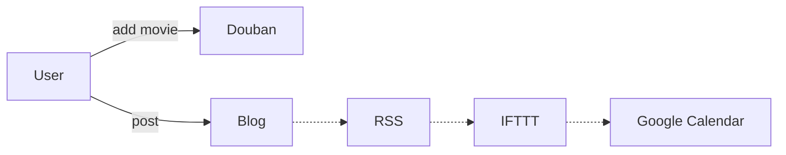
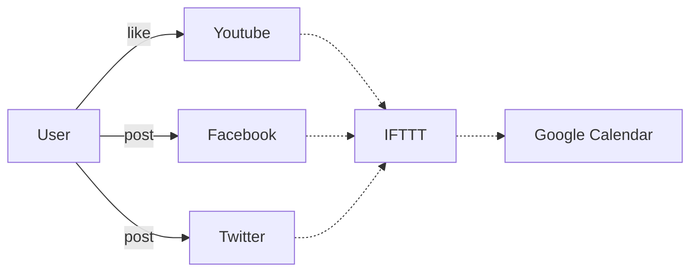
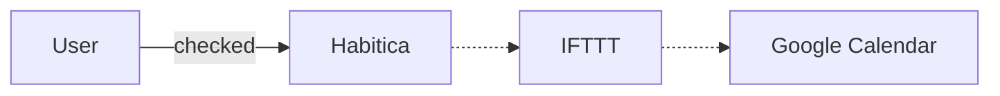
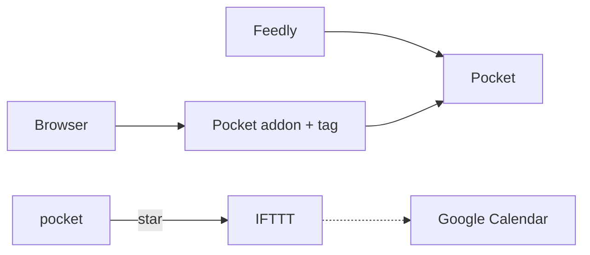
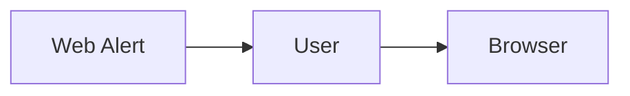
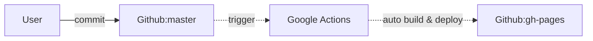

import Mindmap from '@theme/Mindmap'

<Mindmap markdown={`
## 自動化工具
### 手機
  - Google Home
### 網路服務
  - Dropbox
  - IFTTT
### 自架
  - Github Actions
  - NAS
`} />

2017年開始紀錄自己使用的自動化紀錄工具。今年的自動化程度其實退步了不少，主要是一些以前依賴的第三方服務如Anobii(不維護)或豆瓣(要實名認證)都紛紛出現了問題。用一年下來，Joplin 確實解決了我隨時筆記與累積的問題。

## 為什麼要做個人自動化紀錄?

有人會問，Facebook/Twitter不就可以記錄大小事了嗎? 如果會這麼回答，那就實在太天真了:smirk:。FB上也許包含了自己覺得值得分享的事，但生活中還有諸多事情值得記錄，而不適合與大眾分享。

或是想整理過去公開紀錄，造訪過去使用過的社交平台（Plurk, Google+, Blogger）已非常難以找出過去的隨筆或評論。

擁有自己的一份完整數位化生活記錄，是我持續的個人目標之一。要達成這個目標，需要藉助一些自動化紀錄工具，好讓整個過程變得自然而不困難。

<!-- truncate -->

## 混用多種工具

沒有一個工具可以滿足方方面面的需求。因此比較實際的方式，是混用多種工具以達成目標。
幸好，自動化的目標就是讓事情更少需要經過人工處理，因此各種工具設定好之後，期待他們能自動運作，只要定期維護檢視就好。

手機上透過 Google Home 和 Dropbox，網路服務透過 IFTTT、Github Actions 和 NAS，將各種服務整合起來使用。

<Mindmap markdown={`
## 取得即時資訊
- Google Home
  - Google Assistant
## 備份自動化
- NAS
  - CloudSync
  - Photos
- Dropbox
## 記錄自動化
- 小米手環, 體重計, IFTTT, Moneybook, CoinStats
`} />

## 即時資訊自動化

透過 Google Assistant 取得自己關注的資訊。

## 照片自動化備份 :camera:

* [Dropbox](http://www.dropbox.com/), 自動從手機上傳照片
* Google相簿, 充電時自動從手機備份照片到Google雲端
* NAS (Synnalogy), 透過`Cloud Sync`從Dropbox同步照片。

## 運動自動化紀錄 :walking:

* 記步，睡眠紀錄：小米手環6
* 體重：小米體重計

再透過小米運動 App 同步到 Google Fit

行走目標為每天4000步。

但比較常看的是 Pikmin Bloom

----

## 自動記帳

透過 Moneybook 和 [CoinStats](https://coinstats.app/)，搜集絕大部分的帳戶資料。

----

## 生活事件自動化紀錄

延續[用 IFTTT 做自動生活紀錄](life/LifeLog-via-IFTTT.md)這篇的思路，我把看過的書籍、電影，喜歡的Youtube影片，貼過的文章,每日完成的事項都記錄到Google日曆中，以方便之後回顧。

### 自動閱讀/觀看紀錄 :books:

~~對於電影, 我使用RSS + IFTTT + Google Calendar來自動紀錄。當我在豆瓣上修改狀態，豆瓣的RSS也跟著改變，這時IFTTT會將RSS中的新事項紀錄到Google 日曆上~~ (無法登入，因為豆瓣實名認證需要大陸手機號碼...)

對於Youtube上like的影片，Facebook或Twitter上新貼的文章，也會透過IFTTT紀錄到Google 日曆上。

透過RSS轉IFTTT紀錄

直接透過IFTTT紀錄

### 自動紀錄每日完成的事項 :notebook:

使用 [Habitica + IFTTT + Google Calendar](make/habitica-ifttt) 也可達成自動紀錄。
我在Google Calendar上使用一個單獨的日曆(`成功日記`)來紀錄每日完成的事項。
~~讀完一本書的時候，也是透過完成 Habitica 上對應的待辦事項，顯示在日曆上。~~
讀書看影片改記錄在 Joplin 的每週紀錄中。

| 我其實非常少開Google日曆，所以目前這樣的設定其實重複回去察看的機會也不高（目前我會手動紀錄在實體筆記本或 joplin 的每週紀錄上）。看看之後有什麼契機可以改進。

### 紀錄看過或待看的網頁 :globe_with_meridians:

我會將待看的文章搜集到[Pocket](https://getpocket.com/)。

~~除了瀏覽Facebook或Twitter上的文章，我也使用Feedly訂閱一些自己挑選過的網站。並將Feedly設定成當我做標記時，就將本篇文章轉存到Pocket稍候閱讀列表，我可以掃過Feedly列表，標記感興趣的新聞，稍後再到Pocket閱讀。~~

在手機或電腦上看到想讀的文章，會先送到 Pocket 待讀列表中。這樣讓我在看到文章連結當下不需急著看完整篇文章，而是在有空閒的時候才閱讀這些文章。

我唯一的待辦事項收件夾是[Habitica](https://habitica.com/)，若看到值得閱讀(紀錄)的網頁，桌面上我使用瀏覽器的`Pocket`外掛插件(Firefox瀏覽器內建)，將待看網頁記錄到Pocket中。

在手機上直接使用 Habitica 和 Pocket 等 App，達到一樣的效果。

若在Pocket中覺得這個文章不錯，打星星收藏起來，將會自動記錄到Google日曆中。

### 文章更新時自動提醒 :alarm_clock:

~~有些網站並未提供RSS訂閱，手機上我會使用[Web Alert](https://play.google.com/store/apps/details?id=me.webalert)來取得網頁更新提醒 (主要是追小說新章節)~~

因現在只追看某本小說，把網頁開著一天刷一兩次即可。

### 開發工具

#### 設定自動備份

使用VS Code [Settings Sync](https://marketplace.visualstudio.com/items?itemName=Shan.code-settings-sync) ，只需剛開始時設定一次，之後可同步各種VS Code中的設定與插件。

#### 自動更新

盡量使用 brew (Mac) 命令安裝新軟體，透過`brew upgrade`命令一起更新。

----

## 自動化網站部署 :globe_with_meridians:

目前已使用Github來放我的個人網站與部落格，已使用 Github Action 取代 Travis CI 服務。透過與 Google Actions 整合，我所修改的任何內容，在幾分鐘之內都會自動部署到網站上。

| Auto website deploy flow

一些可以直接運作在瀏覽器的專案(如BlocklyDuino和Saihubot)，我會直接將gh-pages設為預設分支，所有改動直接push到這分支中。這樣一有改動即可在網頁上看到更新成果。

---

## 半自動紀錄

### 半自動工作紀錄 :briefcase:

透過翻看Github Pull request + Asana，我可以輕易地將過去一週達成的事項整理出來，再送PR到Github上。
也可以說這塊目前只能算半自動化地列出過去事項列表，可以再繼續改進。

### 定期回顧與整理

我在Joplin中增加一個`Template`項目，裡面放了周檢視/月檢視/季檢視/年檢視樣板。

在 Habitica 中透過重複時間設定，每段時間自動提醒該做檢視了。

每月固定行程示意：

- 打開某報表，將每月收益記下來
- 將某軟體資料匯出成csv檔，到 CoinStats紀錄
- 將上個月的紀錄搬到年度紀錄中

這時會稍微做一點整理

回顧: 簡化再簡化後，還是常會跳過定期回顧與整理的部分。目前只能達到半年左右較完整回顧一次。

### 照片備份規則

由於Dropbox空間有限，會不定期將Dropbox上的照片移動到到NAS上按年月份分類的`photo/`資料夾.

我的照片並不算多，但若有出遊的月份通常照片會暴增。所以我的基本備份規則是依年份，並以雙月份命名資料夾,若是當月有重大活動則直接在檔名中標注。
例如2016年的照片資料夾裡會有`2016_10_11`，或是`2016_06_london`這樣的命名。

在整理照片的時候，每當遇到特別喜歡的，我會另存到Dropbox中的一個依年份歸檔的資料夾，例如2017年的精彩照片我會另存到 `dropbox/spot/2017`資料夾中，這樣隨時可以找出來欣賞。

另外每年累積的一些螢幕截圖，也放在當年度的`screenshots`資料夾裡。

### 清理RSS Feed

~~ 透過Feedly訂閱RSS Feed太容易，但是不小心每天收到的新聞量就遠高於自己能吸收的量，這時可以到
https://feedly.com/i/organize/my 把那些失效的連結清掉，並快速檢視一下現在仍在訂閱的網站，是否還對這些主題感興趣。 ~~

## 手動紀錄

為了平衡日常太依靠電子產品的趨向，前年開始就嘗試使用`實體筆記本`作一些紀錄，2018一月中開始嘗試養成更頻繁地使用`實體筆記本`的習慣。在幾經調整後，目前我使用B5方格筆記本做基礎，搭配不同的魔擦筆來作筆記。實體筆記本的好處是除了一般的紀錄，還可以隨意畫心智圖，黏照片，貼紙，蓋印章等。參考各種筆記術書籍，我在每本筆記本前幾頁會空出`索引`區，將筆記本內容索引起來，以便之後查找。

我在Joplin中增加一個`2020年計畫`的文件，保存當年度的周/月/季度紀錄和定期回顧。

## 參考資料
* [我如何做個人自動化紀錄 - 2020 版](life/personal-automation-in-2020.md)
* [我如何做個人自動化紀錄 - 2018 版](life/personal-automation-in-2018.md)
* [我如何做個人自動化紀錄 - 2017 版](life/personal-automation-in-2017.md)
