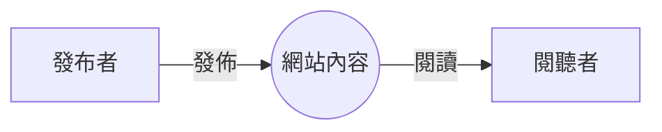
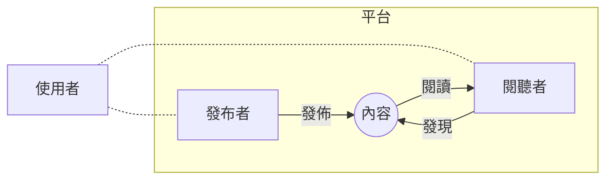
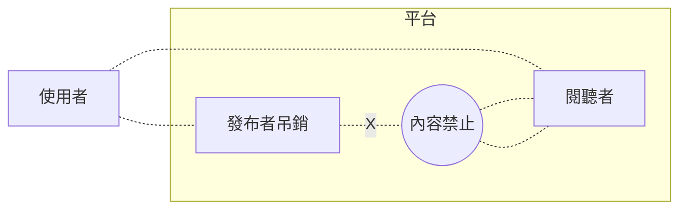
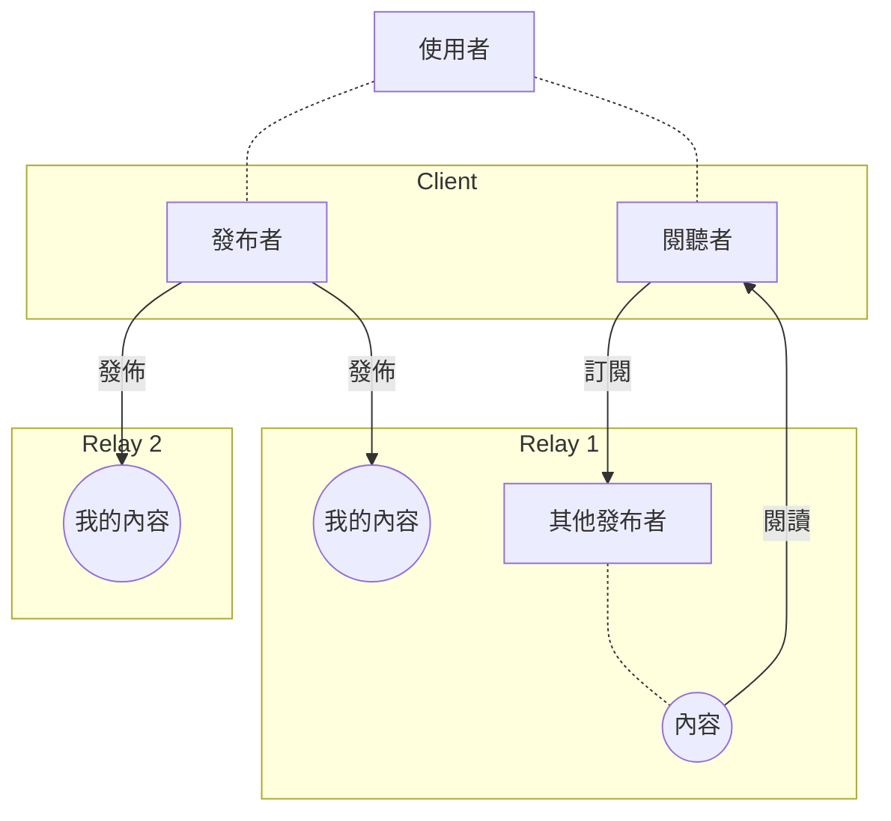

[Nostr](https://github.com/nostr-protocol/nostr) 是一種正在發展中的分散式發佈/訂閱內容協定，基本的規則容易理解，但卻有很高的應用彈性。我才剛開始接觸，先將我理解的部分分享出來。

## Nostr 之前

在網路發展前，內容發佈被控制在媒體手中，大眾需透過電視、報紙等媒介來取得資訊。

早期的網路，只要有頻寬架站加上懂一點 HTML，也可以自行將內容發佈到網路上，閱聽者透過 YAHOO、Google 等搜尋引擎，或是 RSS 訂閱找到內容發佈者的文章。後來 Blogger、痞客邦等平台的出現，讓整個內容發佈流程再簡化。

現在 Facebook、Twitter、微信等社群平台，更進一步將內容發佈門檻降低，並整合進了內容發現機制，讓發佈的內容更容易接觸到閱聽者。

目前的內容發佈機制很成熟了，但其中的缺憾是發佈者並不真正能確保自己發佈的內容。目前多數的閱聽者都處在 Facebook、Twitter、微信平台提供的訊息繭中，躋身於發佈者與閱聽者之間的平台掌握了發佈者的帳號與內容，隨時可以因為某些檢舉，將發佈者所提供的內容下架，甚或關閉發佈者的帳號。

## Nostr 的機制

Nostr 並沒有使用到區塊鏈（Blockchain），但應用了目前大量使用於區塊鏈的加密技術(Crypto)。

Nostr 對於發佈者來說：
1. 公鑰過本地或網頁的客戶端（Client），使用 Nostr 建立帳號（一對公鑰私鑰）與發佈內容。
2. 將每一份公鑰 (Public Key) 都視作一個使用者 (User)。像是手機門號一樣，每個人可以有多份公鑰、可選擇保持或公開自己的隱私。
3. 使用者將要發佈的內容用自己的私鑰簽章後，發送到任意的中繼器(Relay)中。
4. 門號可攜，只要保留好自己的私鑰，同樣的內容可以發送到多個中繼器，如果其中某些中繼器上的內容失效了、還可以透過其他中繼器存取。

Nostr 對於閱聽者來說：
1. 可透過本地或網頁的客戶端，使用 Nostr 協定閱聽內容。
2. 內容發現靠加入一些中繼器(Relay)。
3. 訂閱一個公鑰，就可以從加入的中繼器中取得對應公鑰提供的內容。如果這個公鑰的資料沒有在這個中繼器中，就看不到內容。
4. 中繼器的內容儲存在資料庫中，因此能提供和目前主流平台近似的存取速度。

Nostr 除了定義以上基礎的機制，在他的規格書 NIP 中 (https://github.com/nostr-protocol/nips) 還定義了一些中繼器與客戶端需要支援的協定。

## 如何嘗試

[github](https://github.com/supertestnet/vanilla-js-nostr) 上提供了一個簡單的網站客戶端範例。

在瀏覽器中打開網址 [https://supertestnet.github.io/vanilla-js-nostr/](https://supertestnet.github.io/vanilla-js-nostr/)，這網站已預先建立好了一個帳號（公鑰），並連接到 `wss://nostr-relay.wlvs.space` 這個中繼器。

在畫面上選擇 `Subscribe yourself` (訂閱自己) 可以看到過去其他人使用這個 Demo 帳號的貼文。

填入一些文字後，選擇 `Make public note` (發布公開訊息)，在最下方可以看到剛發佈的貼文。

如果有知道的公開帳號（公鑰），可以填入後選擇 `Subscribe to someone else` (訂閱某人)

## Nostr 可能的應用

上面的的範例中，如果你想要傳訊息給某個發佈者，也可以透過填入對方公鑰，輸入訊息後選擇 `Make private note`（產生私人訊息），則會透過加密機制，產生只有對方才能解開的私人訊息。

透過 Nostr 提供的這些機制，發佈者也有機會將內容發送到支援付費內容的中繼器，讓閱聽者透過某些機制付費才能取得內容。

## 參考資料

- 已註冊的中繼器列表 https://nostr-registry.netlify.app/
