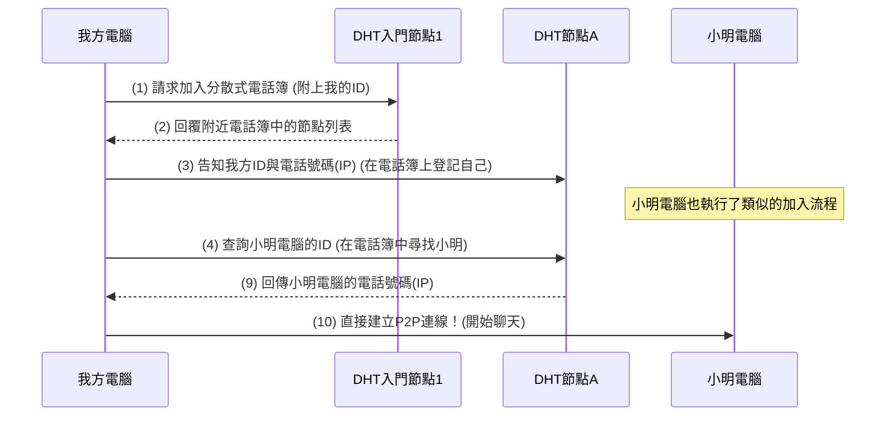

之前介紹過我正在參與的 [Keet 聊天應用程式](tools/keet_2024)，它使用 P2P 架構，傳訊時直接連接你和朋友的裝置，訊息不經過伺服器，有很好的隱私與通訊品質。

就像我們要打電話給朋友，怎麼知道對方的號碼呢？P2P App 之間是怎麼找到彼此，互相連接的呢？今天我們就來聊聊這個 P2P 連線背後的網路架構。

<!-- truncate -->

### P2P 網路：自由自在的通訊

首先，我們來複習一下 P2P 網路。P2P (peer to peer) 就是「點對點」的意思，想像成你和你班上的同學可以直接互相打電話聊天，而不是每次都要先打到學校，再請學校老師轉接給同學。

- **優點**： 這樣很自由，沒有一個老師在中間管理你們的通話。通話建立得快，而且就算老師不在，你們還是可以互相打電話。這就像一些下載電影的軟體，你直接從別人的電腦下載，而不是從一個中央伺服器下載。
- **問題**： 雖然自由，但也有個大問題：如果你們是第一次打電話給對方，根本不知道對方的電話號碼，那怎麼辦？如果不是同一班上的同學，你怎麼知道你的同學現在在哪裡呢？難道在網路時代，還要面對面才能交換號碼嗎？

### P2P 的啟動困境：你、我的手機號碼是多少？

這就是 P2P 網路遇到的「**啟動困境**」。當你和你的朋友小明都剛加入一個聊天應用程式，你們彼此都不知道對方的「網路地址」（就像你不知道小明的手機號碼）。

- 傳統做法（**中央管理**）： 如果有一個「中華電信」伺服器，你們兩個都連上這個伺服器，然後問：「小明的手機號碼是多少？」「我的手機號碼是多少？」，伺服器再將對方的號碼告訴你們，然後你們就可以互相打電話聊天了。但是萬一「中華電信」伺服器壞了，你們就不能連線了，這不是真的點對點通訊。

- **P2P** 的理想（沒有中央管理）： P2P 網路的目標是沒有中央管理，所以我們不能依賴一個「老師」或「中華電信」來幫我們轉接。但如果沒有人告訴我們彼此的地址，我們怎麼才能找到對方，並開始玩聊天呢？

這就像在一個新學校裡，沒有老師介紹，你想和一個別班的新同學聊天，但你們連對方叫什麼、電話號碼是什麼都不知道，根本沒辦法開始聊。

### DHT 的救援：一本「分散式電話簿」

這時候，DHT 網路 (Distributed Hash Table 分散式雜湊表)就登場了！它就像一本「分散式電話簿」，專門解決「你、我的手機號碼是多少？」的問題。

DHT 網路有幾個關鍵的特點：

- **沒有中央電話簿管理員，大家都有一份自己的「電話簿」**： 雖然沒有中央管理員，但每個參與 DHT 網路的機器，都會幫忙記住一部分其他機器的「身份證號碼」（ID）和「電話號碼」（IP 位址）。不是記住全部，而是記住跟自己「比較近」的那些。
- **聰明的指路系統**：當你想找某個人（某台電腦）時，你只要告訴 DHT 網路他／她的 ID。DHT 網路會很聰明地一步一步地把你「指引」到目標。就像你打電話問朋友：「請問小華的電話號碼是多少？」這個朋友可能不知道，但他會告訴你：「你問小明看看，他可能知道。」然後你就一步一步地被指引到目的地。
- **隨時可以加入或離開**：就像你可以隨時買一支新手機加入電話網，或者有人換號碼離開一樣，DHT 網路中的機器可以隨時加入或離開，不會影響整個網路的運作。

所以，P2P 網路可以透過 DHT 來「啟動」連線，就像你需要一本分散式的「電話簿」來找到你的朋友。

### DHT 網路如何用來啟動(Bootstrap) P2P 連線？

現在，我們來看看 DHT 網路協助 P2P 連線的步驟。

- 第一步：**進入「分散式電話簿」**： 當你剛加入 P2P 網路時，你會先連上幾個**已知的 DHT 節點**（就像拿到幾頁電話簿的影本）。這些通常是預先設定好的、較穩定的節點。
- 第二步：**在「分散式電話簿」上登記自己**： 你會把自己（你的 ID 和 IP 地址，也就是「電話號碼」）告訴 DHT 網路中的一些電腦，讓大家知道你的存在。小明一樣也會把自己登記進去。
- 第三步：**透過「分散式電話簿」找到對方**： 當你想跟小明連線時，你只需要小明的 ID。DHT 網路會幫你查詢，一步一步引導你找到小明的 IP 地址。
- 第四步：**直接通話！** 一旦你知道了小明的 IP 地址，你們就可以直接建立 P2P 連線了！就像你拿到了小明的電話號碼，以後就可以直接打電話給他，不用每次都去查電話簿。

一旦你在茫茫網路中找到你的朋友後，你就可以直接打電話給他，不用每次都查電話簿了。這個「第一次連線」的過程，就是 P2P 連線的啟動過程（Bootstrap）。

### 用流程圖來解釋

再以流程圖來解釋一次，請參考以下流程圖：

1. 我方電腦 剛啟動時，會先聯絡預先設定好的 DHT入門節點 (通常是幾個穩定的節點，就像電話簿的入門處)。
1. DHT入門節點 會回覆我方電腦一些它所知道的 DHT節點 清單，讓它能深入這個分散式電話簿網路。
1. 我方電腦會向這些 DHT 節點 「發佈」自己的 ID 和 IP 地址（電話號碼），讓整個 DHT 網路知道它的存在。小明電腦也做了同樣的事情。
1. 當我方電腦想要找到小明電腦時，它會向 DHT 節點 查詢小明電腦的 ID。
1. 如果查詢的節點不知道，它會幫忙轉發請求給它知道的更接近目標 ID 的其他 DHT 節點。
1. 最終，某個 DHT 節點會找到小明電腦的資訊，並把小明電腦的 IP 地址（電話號碼） 傳回來。
1. 一旦我方電腦獲取了小明電腦的 IP 地址，它們就可以直接建立 P2P 連線了，而不需要再透過 DHT 網路。

這樣看下來，有沒比較了解 P2P 網路的運作，和 DHT 對 P2P 網路的幫助哩？

----

資訊公開：我目前負責 Keet 的 Mobile 端的開發，分享自己對整個架構設計的理解。Keet 使用的很多元件都是開源的，你可以在 https://github.com/holepunchto 查看，或看看我整理的 [Awesome-pears](https://github.com/gasolin/awesome-pears)，裡面有更多 P2P 應用程式喔！

對相關技術感興趣的朋友，也歡迎參考[徵才訊息](https://holepunch.recruitee.com/)，歡迎對P2P 技術有研究，或 React Native 的開發者加入。
