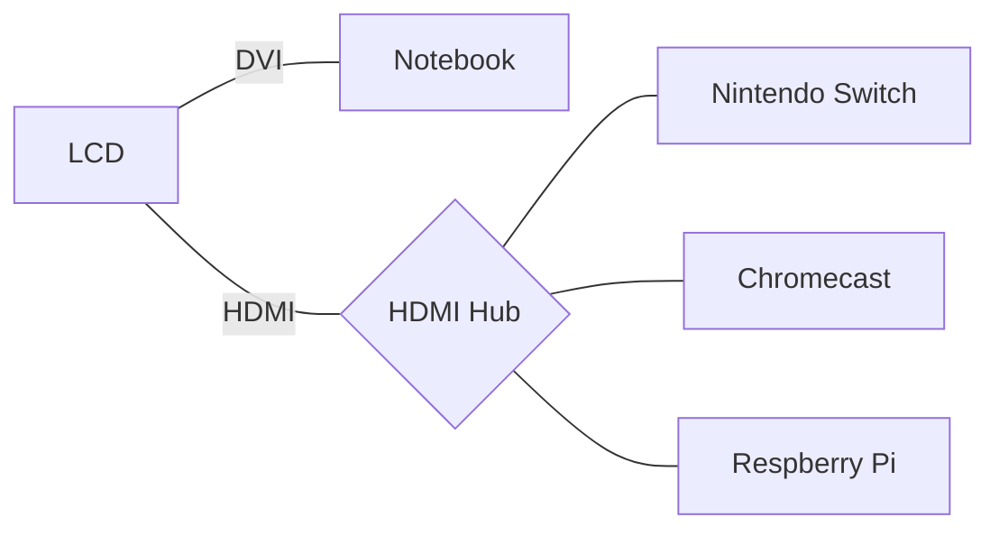

`先記錄下來手邊使用的工具，才有機會從繁雜中歸納出簡單的使用規則。`

2011[^1]年時紀錄了一次當時的個人工具箱，2016年開始再次紀錄自己手邊工具箱的改變[^2] [^3] [^4]🤹。
今年初工作上有了變化，也將家中的環境與筆記工具包含進配置列表中。

## 主要裝備

* :computer:Dell XPS 13 (8550), Windows 10, i7 4GHz x4, 8GB RAM, 13.3" LCD，作業系統：[Elementary OS + Windows](https://blog.gasolin.idv.tw/2017/10/25/xps13-elementary-os/)
* :iphone:[One Plus 3](https://oneplus.net/global/3), Android, 6GB RAM, 5.5" AMOLED
* :headphones:Sony WI-1000 降噪耳機

### :house:家

* :desktop_computer:24" LCD
* :keyboard:羅技K375s鍵盤
* 🖱 羅技M720滑鼠
* :package:Synology NAS: 電影，影集，照片，資料備份
* :bulb:Yeelight LED燈泡
* :dark_sunglasses:Oculus Go: 看影片
* 備用 :computer:Macbook Air 13", 2012年版
* 備用 :tv:Chromecast 一代
* 備用 :speaker:Echodot
* 備用 Respberry Pi 3
* 備用 :orange_book:Kindle Voyage

### 和上一季相比的改變：

主力用:computer:Dell XPS 13"，家中添購了一台:desktop_computer:24" LCD接筆電，搭配3轉1 HDMI Hub，接🎮Nintendo Switch，可滿足影音相關需求。HDMI設備通電時會自動切換到對應的設備。

還是比較少坐在LCD前，因此Chromecast用很少，另購入Oculus Go看影片/Youtube。

:keyboard:羅技K375s鍵盤與🖱羅技M720滑鼠，兩者特點都是同時支援使用USB或藍牙控制設備，讓我可以用一套鍵鼠控制多種設備。

### :spider_web:網站工具

* :spider_web:主要瀏覽器：[Firefox](https://www.mozilla.org/en-US/firefox/products/)
* 瀏覽器插件
  - 顏文字查詢：Emoji cheatsheet
  - 翻譯：ImTranslator
  - 拼字訂正：Grammarly
  - 密碼管理：Bitwarden
  - 擋廣告：uBlock Origin
* 瀏覽器常駐分頁
  - :email:[GMail](http://mail.google.com/), Inbox
  - :calendar:[Google日曆](http://www.google.com/calendar)
  - 📒記帳: [Toshl](https://toshl.com) (付費)
  - ✅待辦事項：[Todoist](https://todoist.com/) (付費)
* :busts_in_silhouette:主要社交網站：[Facebook](http://www.facebook.com/)、[Twitter](https://twitter.com/gasolin)
* :memo:記事：[Google keep](http://keep.google.com/), Google Doc
* :floppy_disk:網路硬碟：[Dropbox](http://www.dropbox.com/), 主要用作同步照片
* 🔑密碼管理：[Bitwarden](https://www.bitwarden.com/)
* :newspaper:新聞聚合：[Feedly](https://feedly.com/)
* :blue_book:閱讀紀錄：[Readmoo分享書](https://share.readmoo.com/mooer/lifaicqb9/bookshelf/gasolin/read)
* :movie_camera:看電影記錄：[豆瓣](http://www.douban.com/)
* :card_index_dividers:個人網站：[個人網站](http://www.gasolin.idv.tw), [Github](https://github.com/gasolin/blog/)
* :card_index_dividers:個人履歷：[Linkedin](https://www.linkedin.com/in/fredglin/)
* :link:IFTTT [自動化生活紀錄2018](https://blog.gasolin.idv.tw/2018/01/26/personal-automation-in-2018/)
* :tv:[Youtube](https://www.youtube.com/)
* :purse:電子錢包[MyEtherWallet](https://www.myetherwallet.com/), [Ledger Nano S](https://blog.gasolin.idv.tw/2017/12/26/setup_ledger_nano_on_linux/)

### 設計工具

* Mockup：[Balsmiq Mockups](http://www.balsamiq.com/products/mockups)
* 螢幕動畫錄製： [Peek](https://github.com/phw/peek)(Linux), [Recordit](http://www.recordit.co/)(Mac)
* 心智圖：XMind, Coggle

### 開發工具

* 編輯器：VS Code
  - Blank Line at the End
  - Diff Tool
  - EditorConfig for VSCode
  - Go
  - Guides: more guide line
  - GitLens: more git info
  - Python
  - Settings Sync
  - solidity
  - Trailing Spaces
* 版本控制：git
* 套件管理：apt (Linux), [nvm](https://github.com/creationix/nvm), yarn, Chocolatey(windows)

若需要在Windows上開發，能用Chocolatey處理的就用Chocolatey處理。

### 娛樂工具

* 🎮Nintendo Switch
* :dark_sunglasses:Oculus Go
* :tv:Chromecast (少用)
* 🎮Steam / vlc (少用)

因為攜帶便利，現在主要只玩NS上的遊戲。Steam上看到喜歡的遊戲，也盡量等NS上出了再買。

## :iphone:Android 手機應用
* 瀏覽器：Firefox for Android
* 網頁更新通知：Web Alert
* 閱讀：Feedly, Readmoo, Pocket
* 信箱：Inbox, Gmail
* 地圖：Google地圖
* 記事：Keep
* 內建相機, 內建時鐘
* 相簿：內建相簿, Google相簿, Dropbox
* 社交：Facebook, LINE, Twitter
* 待辦事項：[Todoist](https://play.google.com/store/apps/details?id=com.todoist)
* 密碼管理：Bitwarden
* 記帳: [Toshl](https://play.google.com/store/apps/details?id=com.thirdframestudios.android.expensoor)
* 線上影片：Youtube
* 音樂：豆瓣FM, Spotify
* 有聲書：Audible, Podcast Addict
* 健康：小米運動, Pokemon Go, 7Min workout

工具

* 2步驟認證：Duo Mobile
* 旅遊：Google翻譯, TripAdvisor
* 影片播放：MX Player, DS video
* 記錄看書狀況：Readmoo分享書
* 線上學習：Udemy, EggHead.io
* IFTTT
* 💳街口支付

## 筆記工具

* B5方格筆記本
* Storage.it 筆記本封套
* 搭配5隻筆
  * Pilot FRIXION BALL Slim 0.38藍色筆桿 + 0.5 魔擦筆筆芯
  * Pilot HI-TEC-C coleto 雙色筆桿 + 0.38 紅/綠筆芯
  * Pilot FRIXION light 水藍色魔擦螢光筆
  * Pilot FRIXION COLORS 褐, 黑色魔擦筆

## Reference

* [^1] [個人工具箱2011](https://blog.gasolin.idv.tw/2013/01/02/%E5%80%8B%E4%BA%BA%E5%B7%A5%E5%85%B7%E7%AE%B12011/)
* [^2] [個人工具箱2016](https://blog.gasolin.idv.tw/2016/12/19/tooling-in-2016/)
* [^3] [個人工具箱2017](https://blog.gasolin.idv.tw/2017/02/02/tooling-in-2017/)
* [^4] [個人工具箱2017九月](https://blog.gasolin.idv.tw/2017/02/02/tooling-in-2017-sep/)
* [^5] [個人工具箱2018二月](https://blog.gasolin.idv.tw/2018/01/25/tooling-in-2018-feb/)
