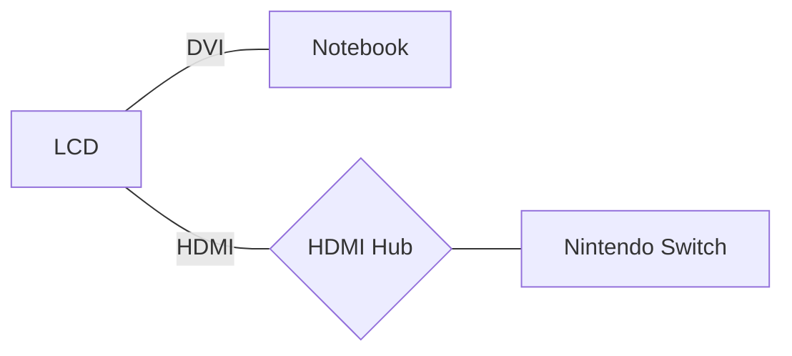

`先記錄下來手邊使用的工具，才有機會從繁雜中歸納出簡單的使用規則。`

2011[^1]年時紀錄了一次當時的個人工具箱，2016 年開始再次紀錄自己手邊工具箱的改變，後來漸漸變成了常規文章 [^2] [^3] [^4 ][^5 ][^6]🤹。

## 主要裝備

* :computer:Dell XPS 13 (8550), i7 4GHz x4, 8GB RAM, 13.3" LCD，作業系統：[Elementary OS + Windows](tools/elementary_juno.md)

* :iphone:[Zenfone 5](https://www.asus.com/tw/Phone/ZenFone-5-ZE620KL/Tech-Specs/), Android 9(Pie), Snapdragon 636, 6.2" Super IPS

* :headphones: Jabra Elite 65t (備用：Sony WI-1000 降噪耳機):

## 🚶‍♂️ 外出攜帶

* :computer:Dell XPS 13 (8550)
* :iphone:Zenfone 5
* :electric_plug:小米45W電源
* 🖱 羅技M720滑鼠
* :headphones: Jabra Elite 65t
* USB C/Micro USB 雙頭轉接線

### :house:家

* :electric_plug:小米45W電源
* 🖱羅技M720滑鼠
* :package:Synology NAS: 電影，影集，照片，資料備份
* 備用：:desktop_computer:24" LCD
* 備用：:keyboard:羅技K375s鍵盤
* 備用：:bulb:Yeelight LED燈泡
* 備用：:dark_sunglasses:Oculus Go: 看影片
* 備用 :computer:Macbook Air 13", 2012年版
* 備用 :orange_book:Kindle Voyage

### 和上一季相比的改變：

主力用:computer:Dell XPS 13"搭配🖱羅技M720滑鼠。現在幾乎不坐在LCD前。同時，因為筆電儲存256GB分作兩半其實不是很夠用的緣故，作業系統也只留下了 Elementary OS。

現在的工作型態比較常在家或外出到定點工作，和上一季最大的改變就是使用:electric_plug:小米45W電源來取代 XPS 的電源線和 Switch 的電源線。小米 45W 電源可為:computer:筆電與 🎮Nintendo Switch 供電，省下帶兩大塊電源線的麻煩。再加帶很久以前買的 5000mAh 小米電源和 USB C/Micro USB 雙頭轉接線，可解決大部分手機/耳機的充電問題。

考慮買一顆紫米10 15000mAh，這樣一顆就可為筆電/遊戲機/手機/耳機，這樣平時出門都不用帶電源線了。(但其實平常也不會帶遊戲機，換15000mAh似乎要帶的更重 XD)

:keyboard:羅技K375s鍵盤與🖱羅技M720滑鼠，兩者特點都是同時支援使用USB或藍牙控制設備，讓我可以用一套鍵鼠控制多種設備。

### :spider_web:網站工具

* :spider_web:主要瀏覽器：[Firefox](https://www.mozilla.org/en-US/firefox/products/)
* 瀏覽器插件
  - 顏文字查詢：Emoji cheatsheet
  - 翻譯：ImTranslator
  - 拼字訂正：Grammarly
  - 密碼管理：Bitwarden
  - 擋廣告：uBlock Origin
* 瀏覽器常駐分頁
  - :email:[GMail](http://mail.google.com/), Inbox
  - ✅待辦事項：[Todoist](https://todoist.com/) (付費)
  - Slack
* :busts_in_silhouette:主要社交網站：[Facebook](http://www.facebook.com/)、[Twitter](https://twitter.com/gasolin)
* :memo:記事：[Google keep](http://keep.google.com/), Google Doc
* :floppy_disk:網路硬碟：[Dropbox](http://www.dropbox.com/), 主要用作同步照片
* 🔑密碼管理：[Bitwarden](https://www.bitwarden.com/)
* :newspaper:新聞聚合：[Feedly](https://feedly.com/)
* :blue_book:閱讀紀錄：[Readmoo分享書](https://share.readmoo.com/mooer/lifaicqb9/bookshelf/gasolin/read)
* :movie_camera:看電影記錄：[豆瓣](http://www.douban.com/)
* :card_index_dividers:個人網站：[個人網站](http://www.gasolin.idv.tw), [Github](https://github.com/gasolin/blog/)
* :card_index_dividers:個人履歷：[Linkedin](https://www.linkedin.com/in/fredglin/)
* :link:IFTTT [自動化生活紀錄2018](life/personal-automation-in-2018.md)
* :tv:[Youtube](https://www.youtube.com/)
* :purse:電子錢包[MyEtherWallet](https://www.myetherwallet.com/), [Ledger Nano S](crypto/setup_ledger_nano_on_linux.md)

### 設計工具

* 螢幕動畫錄製： [Peek](https://github.com/phw/peek)(Linux), 備用 [Recordit](http://www.recordit.co/)(Mac)
* 心智圖：Coggle, 備用 XMind

### 開發工具

* 編輯器：VS Code
  - Blank Line at the End
  - Diff Tool
  - EditorConfig for VSCode
  - Guides: more guide line
  - GitLens: more git info
  - Settings Sync
  - solidity
  - Trailing Spaces
* 版本控制：git
* 套件管理：apt (Linux), [nvm](https://github.com/creationix/nvm), yarn, Chocolatey(windows)
* :bellhop_bell: 專注工具：:tomato:Rush(蕃茄鐘)

若需要在 Windows 上開發，能用 Chocolatey 處理的就用 Chocolatey 處理。

### 娛樂工具

* 🎮Nintendo Switch
* :dark_sunglasses:Oculus Go (少用)
* 🎮Steam / vlc (少用)

因為攜帶便利，現在主要只玩 NS 上的遊戲。Steam 上看到喜歡的遊戲，也盡量等 NS 上出了再買。

## :iphone:Android 手機應用
* :spider_web:瀏覽器：Brave
* :bell:網頁更新通知：Web Alert
* :newspaper:閱讀：Feedly, Readmoo, Pocket
* :email:信箱：Inbox, Gmail
* :world_map:地圖：Google地圖
* 記事：Keep
* 內建相機, 內建時鐘
* 相簿：內建相簿, Google相簿, Dropbox
* 社交：Facebook, LINE, Twitter(網頁版)
* 待辦事項：[Todoist](https://play.google.com/store/apps/details?id=com.todoist)
* :closed_lock_with_key:密碼管理：Bitwarden，Duo Mobile（2步驟認證）
* :tv:線上影片：Youtube
* 音樂：Spotify
* 有聲書：Audible, Podcast Addict
* 🚶‍♂️ 健康：小米運動, Pokemon Go, 7Min workout
* :mantelpiece_clock:時間紀錄： SaveMyTime

手機瀏覽器改使用Brave。記帳改使用實體筆記本紀錄。[完整的實體筆記配置](life/handbook.md)

### 其他工具

* 旅遊：Google翻譯, TripAdvisor
* 影片播放：MX Player, DS video
* 記錄看書狀況：Readmoo 分享書
* 線上學習：Udemy, EggHead.io(網頁版)
* IFTTT
* 💳街口支付

## Reference

* [^1] [個人工具箱2011](tools/tooling-in-2011.md)
* [^2] [個人工具箱2016](tools/tooling-in-2016.md)
* [^3] [個人工具箱2017](tools/tooling-in-2017.md)
* [^4] [個人工具箱2017九月](tools/tooling-in-2017-sep.md)
* [^5] [個人工具箱2018二月](tools/tooling-in-2018-feb.md)
* [^6] [個人工具箱2018六月](tools/tooling-in-2018-jun.md)
