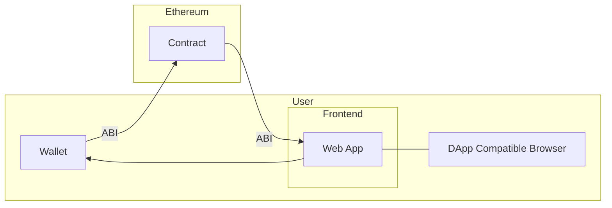
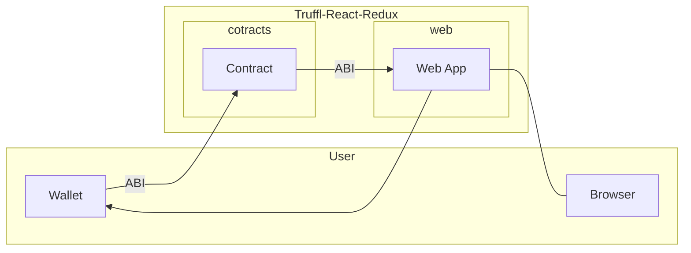

How `truffle-react-redux` looks like:




```sh
truffle unbox gasolin/truffle-react-redux
Downloading...
Unpacking...
Setting up...
Unbox successful. Sweet!

Commands:

  Install sub project dependencies (already ran after unpack): npm run bootstrap
  Compile contracts:                                           npm run compile
  Migrate contracts:                                           npm run migrate
  Runs the web dapp in the development mode:                   npm start
  Pump sub project packages version:                           npm run publish
  ```
