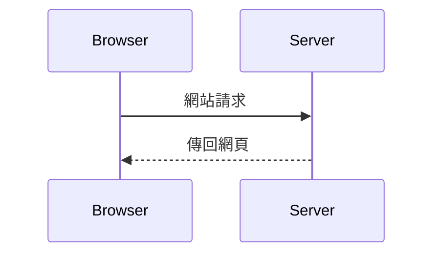
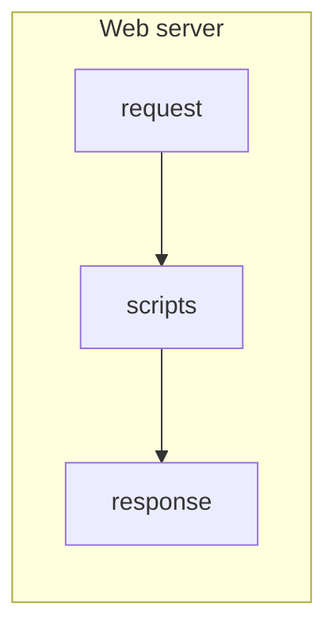

## 網頁有兩種

網頁類型可以簡單分為兩類：靜態網頁和動態網頁[^1]。在上一篇文章中我們介紹了基本的網頁運作方式，即瀏覽器請求網頁，網站伺服器傳回網頁。

這個模式適用於所有的網頁。對於瀏覽器來說，靜態網頁和動態網頁並沒有差別，都是收到一份完整的網頁後開始解析。
靜態網頁和動態網頁的區分，主要是發生在網站伺服器端。

## 靜態網頁

一般常見的網站伺服器如Apache或NGINX都同時支援靜態網頁與動態網頁。當網站伺服器收到網頁或資源的請求後，會根據網站伺服器的配置來回應使用者的請求。
當網站伺服器查詢到這個請求網址目的為靜態（static）檔案時，網站伺服器會直接傳回固定的網頁或資源檔案。

## 動態網頁

動態網頁和靜態網頁是相對應的概念。靜態網頁提供的網頁內容是固定不會改變的，而動態網頁的內容則可根據時間，地點，登入的使用者等不同而呈現不同的內容。
動態網頁的內容依然是透過網站伺服器產生，瀏覽器只負責將從網站伺服器回傳的內容呈現出來。

支援動態網頁的網站伺服器，在收到網頁或資源的請求後，會透過CGI[^2]或WSGI[^3]界面，交由佈署在伺服器裡的動態網頁腳本進行處理。

在動態網頁中，在請求（Request）網址與回應（response）網頁內容間，都是由程式腳本負責處理（script）。程式腳本需要解析請求（Request）訊息，根據提供的網址處理對應的行為並回應（response）對應的網頁。在處理過程中，程式腳本可能需要處理取得網址參數或表單參數等內容，存取資料庫，把對應的資料填入網頁樣板等等工作。

早期90年代在Web與瀏覽器剛發明時，網頁只有靜態網頁一種。這時候架網站主要的目的是個人拿來分享感興趣的資訊。因此當時流行的是製作個人「烘培機」（Home Page）。直到有了動態網頁之後，才有了現在蓬勃的電子商務與各式網路服務。一項網站伺服器端的改變，就讓我們的網路生活更加地豐富多彩。

### 參考資料：

[^1]: https://en.wikipedia.org/wiki/Dynamic_web_page
[^2]: https://en.wikipedia.org/wiki/Common_Gateway_Interface
[^3]: https://en.wikipedia.org/wiki/Web_Server_Gateway_Interface
[^4]: [化整為零的次世代網頁開發標準: WSGI](http://blog.ez2learn.com/2010/01/27/introduction-to-wsgi/)
