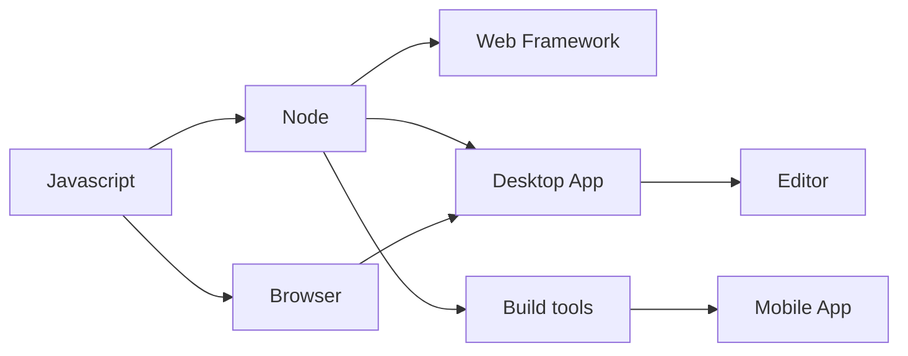

2009年推出的Node.js[^1]是讓Javascript成為一門廣為通用的程式語言的關鍵。Node.js將原專為Chrome[^2]瀏覽器開發的V8引擎抽離出瀏覽器，讓使用者在一般命令行環境中就可以執行Javascript。

## 開發者的需求

要完成一個全功能的現代網站，開發者除了需要至少理解某門語言相關的網站後端技術之外，Javascript也是身在Web開發領域的開發者至少必須"略懂"的腳本程式語言(scripting language)。

既然不管精通哪門程式語言的開發者，想在瀏覽器上發揮，都仍需要某種程度地熟悉Javascript程式語言。那麼，如果在瀏覽器之外，也可以拿Javascript來做事情不是很好嗎?

## Node.js

Node.js並不是第一款讓使用者在一般命令行環境中就可以執行Javascript的工具(最早推出的可能是Mozilla的Rhino或XULRunner[^3])，但它跟上了潮流。
2008年推出的Chrome瀏覽器，裡面使用了同被KDE與Apple使用的Webkit作為渲染引擎(Render)，並自行開發了全新的Javascript引擎(V8引擎)。Chrome瀏覽器的V8引擎率先支援JIT(Just in Time)編譯技術，使得當年Javascript的執行效率一舉提升了8倍以上:chart_with_upwards_trend:。基於V8引擎的Node.js也比其他Javascript運行環境有更強的競爭力。由於執行速度的改善，Javascript語言終於有了和其他程式語言在瀏覽器之外的環境同場競技的實力。

## Node.js的好夥伴: NPM

Node.js推出當時，除了擁有一個比其他相似競爭者快上幾倍的引擎之外，在隔年整合的NPM(Node Package Manager)[^4]套件管理工具，讓Javascript開發者擁有了更有效率地分享與重用函式庫的方式。到了今天，下載大多數使用Javascript語言撰寫的專案，只要執行`npm install`(或衍生的`yarn install`)，NPM就能自行安裝與解決套件之間的依賴關係。NPM實是今日Node.js之所以能形成圍繞著Javascript語言建立起龐大生態系的不可或缺的功臣。

## Node.js衍生發展

隨著Node.js更加成熟，Web開發者也圍繞著Node.js重新發明他們常用的工具。最先是Web開發框架（如Express.js[^5], hapi, koa）與資料庫接口，再來是相關的編譯工具（grunt, gulp, webpack[^6]）。同時，也有人開始嘗試將Node.js與原有的瀏覽器環境結合，讓開發者得以使用網頁相關技術打造桌面應用（nw.js, electron[^7])。基於此技術還發展了數個流行的程式編輯器（atom, Visual Studio Code[^8]）。時至今日，也可透過Node.js相關編譯工具，使用網頁相關技術來做行動裝置App開發（Cordova, React Native[^9]）。圍繞著Node.js的種種發明，讓使用網頁技術的開發者，得以從開發到部署，全都在圍繞網頁技術的生態系中完成。並由此誕生了稱之為 "Full Stack" 全端工程師（前端，後端，整合，測試）和大前端工程師的工作。全端工程師除了需處理網頁端（前端）頁面版型與互動效果外，也要兼顧伺服器端（後端）與資料庫處理。大前端工程師則是除了網頁端之外，也須兼顧行動裝置App的開發。

## 參考資料

* [^1] [Node.js](https://en.wikipedia.org/wiki/Node.js)
* [^2] [Google Chrome](https://en.wikipedia.org/wiki/Google_Chrome)
* [^3] [XULRunner](https://en.wikipedia.org/wiki/XULRunner)
* [^4] [NPM](https://en.wikipedia.org/wiki/Npm_(software))
* [^5] [Express.js](https://expressjs.com/)
* [^6] [webpack](https://webpack.github.io/)
* [^7] [Electron](https://electron.atom.io/)
* [^8] [Visual Studio Code](https://code.visualstudio.com/)
* [^9] [React Native](https://facebook.github.io/react-native/)
