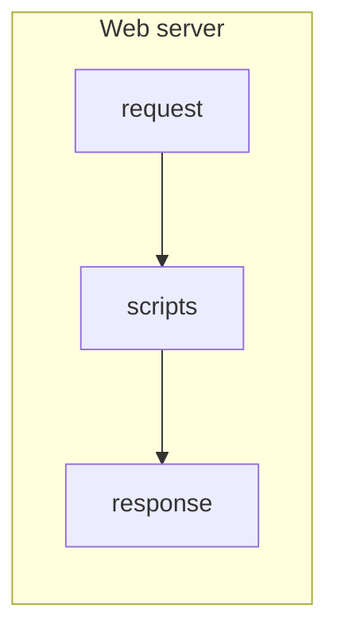
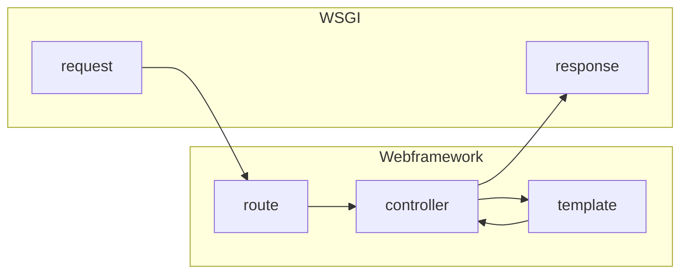
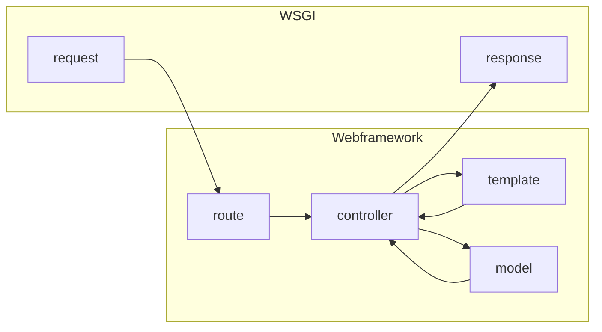

## 為什麼需要網頁框架？

在上一篇文章中我們介紹了動態網頁的運作方式：網站伺服器在收到網頁或資源的請求（Request）後，交由佈署在伺服器裡的動態網頁腳本，根據提供的網址處理並回應（response）對應的網頁。

我們現在日常用到的許多網站，其中要處理的工作遠比這個示意圖複雜。例如許多網站需要從資料庫中存取資料，或是需要更容易地保持頁面之間的一致性。因此透過各種程式語言撰寫的「網頁框架」也應運而生。
「網頁框架」除了可以簡化諸多開發網站時會碰到的需求，還可以重用或繼承其他人做過的工具和經驗。比起直接寫腳本自行處理所有事情，大多數網站會選用各種「網頁框架」來開發。

## 網頁框架處理哪些事?

當網站伺服器在收到不同的網頁或資源的請求（Request）後，開發者需要處理的事情有：

* 根據網址的組成，指定不同的腳本處理
* 取得網址參數
* 把對應的資料填入網頁樣板

支援這些，可說就構成一個基本網頁框架了。如Python的[flask](http://flask.pocoo.org/)或Node(Javascript)的[express](http://expressjs.com/)。

除此之外，許多網頁框架還可以進一步擴展，以滿足以下需求：

* 取得表單參數
* 存取資料庫
* 查看 Cookie / Session
* 檢查登入狀況

光是「存取資料庫」一項，就有無數協助開發者簡化存取資料庫的方式，在此不一一細述。

有了網頁框架，開發者得以重用或繼承前人提供的相關工具與開發經驗。使得動態網站變得更容易開發，大型網站也變得更容易維護。
