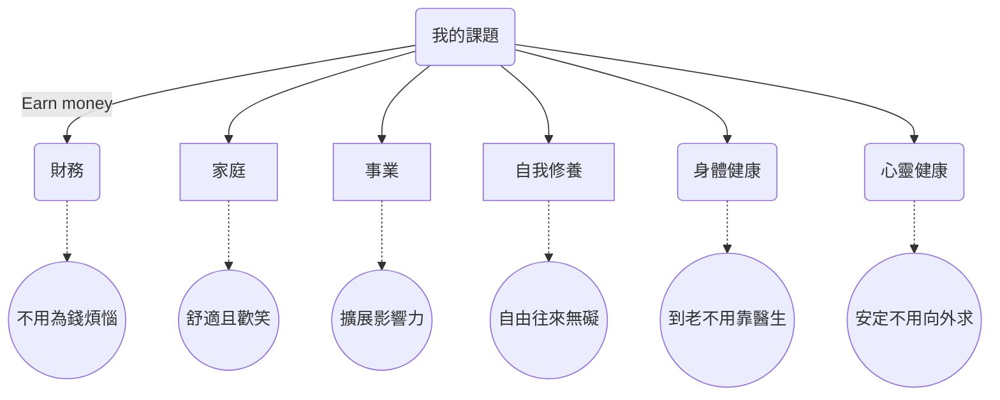

從多年前看到「夢想金字塔」一書時，就很喜歡裡面提到的概念。
書中將人生的課題分為「財務」，「家庭」，「事業」，「自我修養」，「身體健康」，「心靈健康」。「夢想金字塔」為這些課題提供了一個可參考的框架：

「財務」講的是生活中所需的金錢，擺在金字塔的頂端。當這塊出問題時，會大大影響金字塔下方的各方面。
「家庭」，「事業」是金字塔的中層，是自己與外部的觸角，影響自己，也影響其他人的生活。
「自我修養」，「身體健康」，「心靈健康」則是金字塔的基石。自我的身，心，靈狀態，是自己與所有人交流的基礎。

每個人都可以在人生的各個階段，提出自己對這些人生課題的想法（認知），或是更進一步地設定想要達到的目標。

在2019年的最後一日，我也想試著

有辦法量化這些人生課題嗎？

有另外一種對這些人生課題的比喻：大部分的人像是小丑一般，不斷地在拋接這些人生課題，試圖在其中取得平衡。

## 參考資料

[1] https://www.managertoday.com.tw/articles/view/53559
