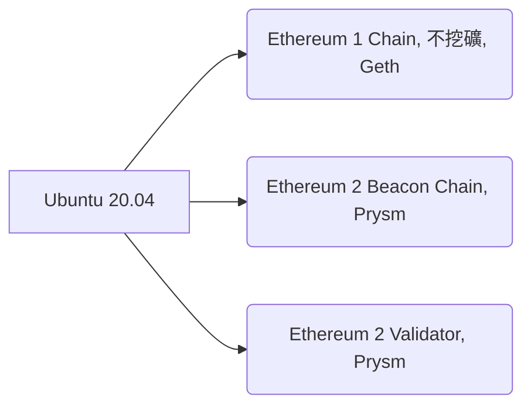

[以太坊 (Ethereum)](https://zh.wikipedia.org/zh-tw/%E4%BB%A5%E5%A4%AA%E5%9D%8A)作為 2014 年才開始區塊鏈的專案，近年發展迅速，眾多在以太坊上的活動讓目前的每秒交易速度(~13 TPS)已不符所需。經過多年的實驗與討論，以太坊 (Ethereum) 的下一代 [Ethereum 2.0 路線圖](https://www.blocktempo.com/the-state-of-eth2-june-2020/)也已經越來越清晰。

目前以太坊 (Ethereum) 2.0 即將進展至 Phase 0 階段。在此階段以太坊 1.0 和 2.0 的網路將並存。直到發展到 Phase 1.5 階段，1.0 網路將會融合進 2.0網路。隨著時間接近，2.0 測試網路與多種驗證節點的測試版也陸續釋出，網路上已有許多經驗可參考，正是嘗試的好時機。

這邊略過各種基礎介紹，直接從如何運行以太坊 (Ethereum) 2.0 的驗證節點開始。

如果覺得這篇文章有用，歡迎傳送小費到 0xfDa995Eb398750319a2D5E8A4766c02e54db24b8 (或 gasolin.eth)

## 快速入門 (硬體需求)

- 驗證節點需要 24 小時運作（可短時間離線）
- Passmark CPU Mark (x86, ARM) 分數至少 4000 分
- 至少 512G 的 SSD
- 運作期間會長期佔用 300k bps 左右的網路頻寬

在[參考相關文章，並考慮整體成本](https://www.facebook.com/groups/taipei.ethereum.meetup/permalink/1435541646639005/)後，我選擇樹莓派4代 (Raspberry Pi 4) 4GB版當作主機，搭配 512G 的 USB 介面外接 SSD 來跑驗證節點(總能耗 = 機器本身最高耗能 5V * 3A = 15W，再加上家用路由器要一直開著著的能耗。樹莓派4一般能耗應該在5~9W之間)。

神奇的是，需要的硬體竟然在 PCHome 就可以一次買齊 😎


(我已有 16G+ SD卡，SD卡讀卡機，HDMI外接螢幕，USB外接鍵盤)，林林總總必要成本大概在 7000 元內。

## 快速入門 (軟體需求)

驗證節點需要
1. 參考 Ethereum 1.0 的區塊鏈節點
2. 同步 Ethereum 2.0 Beacon鏈
3. 運行 Ethereum 2.0 的 Validator（驗證者節點）

因此軟體中需要包含



硬體準備好後，若想要快速開始體驗，可以參考 [EthereumOnARM](https://github.com/diglos/pi-gen/tree/ethraspbian2.0/) 專案提供的 [ROM 版本](https://www.reddit.com/r/ethereum/comments/hhvi2r/ethereum_on_arm_new_eth20_raspberry_pi_4_image/)
或是參考他的[腳本](https://github.com/diglos/pi-gen/tree/ethraspbian2.0/stage2)來設定（請留意使用他人包好的 ROM 的風險）。

## 快速入門 (軟體設定)

> 把 SD 卡燒好，路由器上開 13000/30303 port forwarding，接上網路，就自動裝好自動跑

### 1. 燒 ROM

下載好 EthereumOnARM ROM 之後，在電腦上使用 balena Etcher 等燒錄軟體，將ROM燒錄到SD卡中。

### 2. 設定機器

將網路線接到樹莓派4上，插入燒好ROM的SD卡，並將外接SSD插到藍色的USB接口上。
通上電源後，即會自動開機並執行所有的設定（系統調整，格式化 SSD，安裝所需程式）。

出現登入提示後以 ethereum/ethereum 登入。
登入後可以使用命令 `hostname -I` 查看機器目前分配到的 IP。

```sh
$ hostname -I
192.168.1.123
```

### 3. 查看運作狀態

這時就可以透過其他設備查看樹莓派4的狀態。

開啟瀏覽器，輸入 http://[ip]:3000 ，使用 admin/ethereum 登入，可以看到以下的監視圖表

設備狀態


Ethereum 1.0


Ethereum 2.0 的監視圖表在 Ethereum 1.0 區塊鏈同步完成前，都還不會正常顯示

### 4. 設定網路

打開家用路由器的設定頁面，將樹莓派4分配到以上查到的固定內網IP (如上例就是 `192.168.1.123`)。

在 WAN（外部網路）端設定頁面的`Port Forwarding`，或`虛擬伺服器`設定中，將以下 port 綁定到樹莓派4的內網IP

- 13000 (TCP)
- 12000 (UDP)
- 30303 (TCP, UDP)

這樣從外面傳入這些 port 的封包，就會自動轉傳到樹莓派4。

### 設定驗證者 (Validator)資訊

在Ethereum 1.0 區塊鏈同步完後，可以透過遠端連線的方式來連線到樹莓派4

```
ssh ethereum@192.168.1.123
```

並在瀏覽器上開啟 https://prylabs.net/participate 參照說明申請（需用以太坊錢包）。


申請後如果 validator process 也順利啟動，可以在 Ethereum 2.0 監視圖表中看到 `Validator process started` 訊息。

`Validator Main Info`的`Status`(狀態)欄位也會變成`DEPOSITED`(已存入)狀態。


## 運作之後

恭喜你已經上車了！🤑

你應該要知道，你放了 32ETH （現價7000+美金）在以太坊 2.0 的網路上，一兩年的時間內無法取回到以太坊 1.0 網路上使用。

......😲😱😡🤬

還好，現在跑的還只是測試網路，不用放真的 ETH 😜。

這時候，是不是更應該仔細查看一下當前 Ethereum 2.0 的乘車規則 (Spec) 是不是合理？ 在過程中遇到各種問題時，Ethereum 2.0 網路會怎麼處理？
https://github.com/ethereum/eth2.0-specs/tree/dev/specs/phase0

### 其他軟體設定選擇

可以參考已有一些手動安裝教學如

- https://medium.com/@SomerEsat/guide-to-staking-on-ethereum-2-0-ubuntu-prysm-witti-2b972e697918
- https://hive.blog/ethereum/@tarekadam/altona-test-net-validator-using-raspberry-pi4b-8-gb

教你從 Ubuntu 20.04 開始從頭裝。

## 其他的硬體選擇

可以參考 https://kb.beaconcha.in/community/staking-and-hardware


## 參考資料
- EthereumOnARM 的 Github Repo https://github.com/diglos/pi-gen/tree/ethraspbian2.0/
- 我第一次安裝的 ROM 版本
https://www.reddit.com/r/ethereum/comments/gf3nhg/ethereum_on_arm_raspberry_pi_4_images_release/
- ETH 2 stacking 的即時回報率可參考 https://beaconcha.in/calculator
- 用 Windows 10 或 Mac OS 架 https://kb.beaconcha.in/tutorial-eth2-multiclient
- Prysm 的 Issue Tracker https://github.com/prysmaticlabs/prysm/issues
