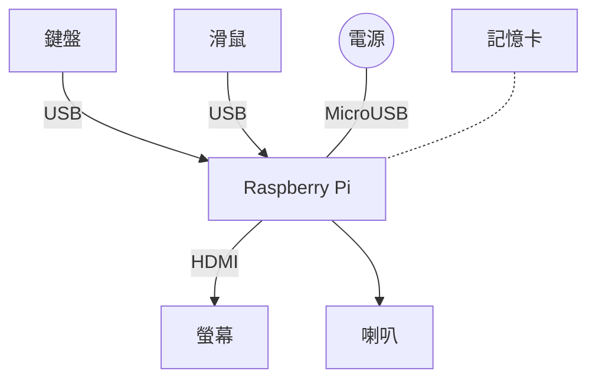

之前嘗試過組裝一些智能玩具，但能讓小朋友持續保持興趣遊玩的並不多。我發現這些玩具一旦需要編程時，多少還是需準備一台電腦。與大人共用電腦多有不便，因此不如就再利用每個人家中多出的Raspberry Pi(?)與生灰的電子設備，幫小朋友準備好所需的相關材料，協助他組一台精簡卻堪用的電腦吧。

## 使用的設備列表

我參考的BUILD（最近Switch上的暗黑破壞神3玩多了...）是[KANO Computer Kit Touch](https://kano.me/store/us/products/computer-kit-touch)套件，這是一套由專門售賣以Raspberry Pi為核心的教育用電腦提供商KANO製作的。現在整套特價在~$230左右，相較其他的STEM教具，整套的價格相當合理。如果你人在美國，家中沒有冗餘的電腦設備或想追求更好的使用體驗，相當建議直接購買一套。

這邊是其他人的[開箱影片](https://www.youtube.com/watch?v=If-I1b-c-ZI)與[評測](https://www.laptopmag.com/reviews/laptops/kano-computer-kit)，介紹了使用到的硬體與作業系統
<iframe width="560" height="315" src="https://www.youtube.com/embed/If-I1b-c-ZI" frameborder="0" allow="accelerometer; autoplay; encrypted-media; gyroscope; picture-in-picture" allowfullscreen></iframe>

以下列出我有用到的設備列表，價格是當初印象裡購入各種設備時的價錢。

- Raspberry Pi 主版
  - 建議使用 3B 或 3B+，速度上才接近可用的電腦
  - (Raspberry Pi 3B ~NT 1450)
- 支援HDMI的螢幕
  - (手邊現有的23吋桌面螢幕 ~NT 4300)
  - (打算再購買10吋觸控螢幕 ~NT 3000)
- 播音設備
  - 沒有喇叭的話，用手機附的耳機聽也行 (但為了小朋友聽力，要用耳機也建議用耳罩式或頭戴式)
  - (手機附的耳機, ~NT 0)
  - (考慮弄個手機喇叭來接 ~NT 100)
- 電源
  - 可用舊手機的 Micro USB 充電線與充電頭，或任何手邊的行動電源
  - (小米行動電源 5000 ~NT 300)
- USB 鍵盤/滑鼠
  - 重用任何現有的鍵鼠，如果有觸控螢幕就不用準備滑鼠
  - (可以找到帶觸控版的鍵盤 ~NT600, 我是拿手邊羅技Unifying鍵盤/滑鼠。)
- Micro SD卡 >16GB
  - (32GB SD卡 ~NT400)

## 準備記憶卡（作業系統）

作業系統我的選擇並非常見的`Raspbian`，而是刷上「KANO」公司為他們販賣的套件提供的 KANO OS。KANO OS作業系統與相關設備的說明書都有提供[自由下載](http://developers.kano.me/downloads/)使用。

將zip檔下載下來後，將Micro SD卡放入轉接器並插入電腦，用任意映像檔燒錄軟體將系統燒錄進SD卡中備用。

## 組裝

由於Raspberry Pi把組裝電腦時複雜的部份都簡化了，組裝起來非常簡單，即使是國小小朋友也能順利完成。

- 將Micro SD記憶卡插入Raspberry Pi (對低年級小朋友來說插卡的動作太精細了，可以先幫忙做)
- 插上鍵盤/滑鼠用的USB接收器
- 接上Micro USB與電源
- 將HDMI線接到螢幕上

最後連接好的架構大概是這樣：

## 上手體驗

雖然手邊還沒有合用的觸控螢幕可試，但即使用滑鼠鍵盤操作，感覺 KANO OS 介面也很親和。從插上記憶卡，接上 Micro USB 初次開機開始，KANO OS 將整個電腦的啟動流程，變成了一段難忘的遊戲過程。

KANO OS 除了提供 Raspbian 中也有附的 Minecraft 等遊戲和各種教育應用，還提供了一套將電腦教學與各種小遊戲/程式整合成的像素RPG。

使用者在電腦設備化成的地圖中行走，初次進入地點是在SD沙灘(SD Beach)，可前往向量村（Vector Village），網路港(Port Ether)，蟒蛇叢林(Python Jungle)等地，探索電腦世界的奧秘。

在SD沙灘上，馬上可以玩到`PONG`這個在電子遊戲歷史中，也具有非凡意義的經典遊戲。

走到向量村則是玩`Make Art`遊戲，可以用鍵盤輸入程式命令來繪圖。KANO近期特別活動是畫骷髏頭(Skull)等萬聖節相關圖案，整個過程都可照著一個步驟一個步驟輸入的提示進行，相當友善。

到了蟒蛇叢林，則是從`使用命令行`開始玩起。透過輸入`python snake`命令來啟動文字版貪食蛇遊戲：過程中會提示使用者可以在輸入命令時加入一些參數，加入參數後遊戲的設定也會跟著調整，使用者可以在遊玩過程中學到命令行的用法，非常地高竿。

我在整個陪伴孩子使用的過程中，感覺就算大人玩起來，KANO OS內容也相當豐富而有趣。KANO OS做到了讓使用電腦充滿樂趣。非常推薦刷來試試，比起Raspberry Pi常搭配的 Raspbian 作業系統，KANO OS 包含更多的教學與引導，更適合入門人群與日常使用（缺點是沒中文介面，但也讓小朋友更有動力學英文）

## 其他心得

如果和我一樣是羅技鍵盤/滑鼠，但是是分別購買的，其實有方法不需要在機器上插兩個Unifying接收器。只要到羅技網站下載[Unifying軟體](https://support.logitech.com/zh_tw/software/unifying)到你常用的作業系統上，安裝後即可設定鍵盤/滑鼠共用同個Unifying接收器，設定完成後，將這個Unifying接收器插到Raspberry Pi上後開機，Raspberry Pi也可以認得你的鍵盤/滑鼠。

Raspberry Pi 3B所要求的2.5A USB電源其實並不容易找到，一般我用1.5A的充電頭也能運作。

Raspberry Pi 也支援HDMI聲音輸出，但需要[另行設定](https://www.raspberrypi.org/documentation/configuration/audio-config.md)。切換過去後，可能是因為同時要傳輸畫面與聲音，得消耗更多電源，開機容易出現`Low Voltage Detected`訊息，並導致無法正常開機。可以在開機畫面中按`Shift`鍵進入`Recovery`模式，將`hdmi_drive=2`(強制使用HDMI輸出聲音)註解掉。
