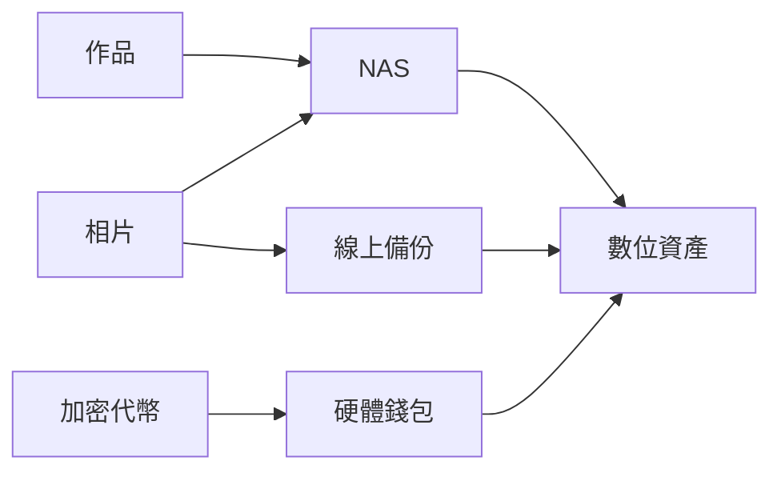

今天已把前陣子買到的 Ledget Nano S 硬體錢包在Windows 10/Elementary OS(/Ubuntu 16.04)上設定好，正式開始使用。和預期一樣，雖然在Linux上剛開始設定時需要多做一些步驟，但是一旦設定好後，使用過程和在其他平台上並沒有區別。

# 硬體錢包

過去透過NAS，外接硬碟等方式來保護自己的相片，作品等「數位資產」，以防哪天檔案遺失或外流。現在要守護的範圍更要擴及「加密代幣」，即保護自己的「數位財產」。



MyEtherWallet網站[推薦](https://myetherwallet.github.io/knowledge-base/hardware-wallets/hardware-wallet-recommendations.html)任何擁有超過「2周的薪資」數位財產的人，使用「硬體錢包」來保管自己的「加密代幣」，以避免可能的財產損失。

目前Ledget Nano S和TREZOR是兩款較多人使用的硬體錢包。硬體錢包的安全性從產生錢包帳號開始。硬體錢包帳號的私鑰一直保存在硬體設備中，只要保存好「recovery phase」(Mnemonic Seed)，不會發生使用線上交易所時帳號或帳戶中的代幣可能被盜的風險。只有在發送代幣時需要解鎖錢包帳號。解鎖錢包帳號時，輸入PIN碼解鎖的過程，也是透過硬體錢包上的按鍵完成，從而避免了所使用的電腦可能已被入侵者安裝鍵盤側錄軟體而造成的財產上的風險。

# 設定流程

## 1. 設定 Ledget Nano S 硬體

在 Ledget Nano S 上透過按壓左右兩顆硬體按鈕，設定4~8字的PIN Code與24個單字的「recovery phase」，並用紙筆等實體方式記錄下來（千萬別用拍照的...）。完成後機器會隨機挑幾個次序測試，而你需要選擇對應的單字來確認安全性。如果以後機器壞了或遺失了，仍然可以透過這24個單字的「recovery phase」來取回帳號。

## 2. 在電腦上安裝 Chrome 或 Chromium

因為目前 Ledger Nano S 使用Chrome App技術來提供桌面應用程式，Chrome也是唯一支援[WebUSB API](https://wicg.github.io/webusb/)的瀏覽器...Google近期公告Chrome App即將被Progressive Web App取代，我們拭目以待Ledger公司將拿出什麼方案來應對。

## 3. 安裝 Ledger Manager

前往[https://www.ledgerwallet.com/apps/manager](https://www.ledgerwallet.com/apps/manager)安裝Ledger Manager。
## 4. 設定 USB 連線

這時開啟Ledger Manager，將Ledget Nano S連線到電腦並解鎖，Ledger Manager無法找到對應的設備。

這時可以參考[What if Ledger Wallet is not recognized on Linux?](https://ledger.zendesk.com/hc/en-us/articles/115005165269-What-if-Ledger-Wallet-is-not-recognized-on-Linux-)在命令行環境下輸入以下命令：

```sh
wget -q -O - https://www.ledgerwallet.com/support/add_udev_rules.sh | sudo bash
```

執行後重新將Ledget Nano S連線到電腦並解鎖，可以看到Ledger Manager開始更新資料。

## 4. 安裝 Ethereum App

Ledger Manager與Ledget Nano S連線後，除了可以更新韌體之外，也能安裝不同的「加密代幣」App進 Ledget Nano S。

這邊選擇安裝Ethereum App。

安裝完成後，在Ledget Nano S上可以看到多出一個`Ethereum`的圖示。

點選進入`Ethereum`，確認`Browser Support`選項為`No` (Ethereum > Settings > Browser Support > No)，這樣稍後安裝的Ledger Wallet Ethereum才能辨識到 Ledget Nano S。

## 5. 安裝 Ledger Wallet Ethereum

參考[How to install and use Ethereum and Ethereum Classic?](https://ledger.zendesk.com/hc/en-us/articles/115005199649-How-to-install-and-use-Ethereum-and-Ethereum-Classic-) 前往[https://www.ledgerwallet.com/apps/ethereum](https://www.ledgerwallet.com/apps/ethereum)下載Ledger Wallet Ethereum App。

安裝好後重新將Ledget Nano S連線到電腦並解鎖，可以看到相關操作界面。

# 使用 MyEtherWallet 取代 Ledger Wallet Ethereum

若不喜歡使用App，還可透過 MyEtherWallet 來存取。

參考[Moving from MyEtherWallet to Ledger](https://myetherwallet.github.io/knowledge-base/migration/moving-from-private-key-to-ledger-hardware-wallet.html) 和[How to use MyEtherWallet with Ledger](https://ledger.zendesk.com/hc/en-us/articles/115005200009-How-to-use-MyEtherWallet-with-Ledger) 這兩篇設定，將`Setting`中的`Contract Data`與`Browser support`選項都設成`Yes`，

```
Ethereum > Settings > Contract Data > Yes
Ethereum > Settings > Browser Support > Yes
```

透過Chrome瀏覽器，在MyEtherWallet中看到`How would you like to access your wallet`選項時，選擇`Ledger Wallet`並在硬體上解鎖即可。

# 參考資料

* BIP39 Mnemonic Code Converter https://iancoleman.io/bip39/
