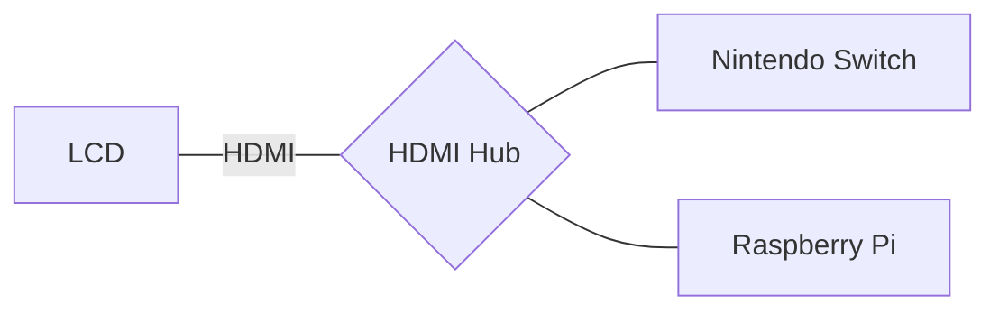

`先記錄下來手邊使用的工具，才有機會從繁雜中歸納出簡單的使用規則。`

2011[^1]年時紀錄了一次當時的個人工具箱，2016 年開始再次紀錄自己手邊工具箱的改變，後來漸漸變成了常規文章 [^2] [^3] [^4] [^5] [^6] [^7] 🤹。

## 主要裝備

* :computer:Apple Macbook Pro 15 (2018), i5 16GB RAM, 13.3" LCD，作業系統：10.14.6

* :iphone:[Zenfone 5](https://www.asus.com/tw/Phone/ZenFone-5-ZE620KL/Tech-Specs/), Android 9(Pie), Snapdragon 636, 6.2" Super IPS

* :headphones: Jabra Elite 65t (備用：Sony WI-1000 降噪耳機)

## :walking_man:外出攜帶

* :computer:Macbook Pro 15 (2018)
* :iphone:Zenfone 5
* :electric_plug:Innergie 60C 電源
* :computer_mouse:羅技M720滑鼠
* :headphones: Jabra Elite 65t
* USB C/Micro USB 雙頭轉接線

### :house:家

* :electric_plug:Ｍacbook PRO 電源
* :computer_mouse:羅技M720滑鼠
* :package:Synology NAS: 電影，影集，照片，資料備份
* 第二螢幕 :desktop_computer:24" LCD + :keyboard:羅技K375s鍵盤 + Raspberry Pi
* 備用 :orange_book:Kindle Voyage

### 和上一季相比的改變：

因為開發 React Native 程式時有需要用 iOS 模擬器測試，改使用:computer:Apple Macbook Pro 15 (2018)搭配:computer_mouse:羅技 M720 滑鼠。

現在的工作型態比較常在家或外出到定點工作。
和前幾季最大的改變，是在家會使用樹莓派展示[第二螢幕](https://blog.gasolin.idv.tw/2019/11/13/second-screen)，除平時動態輪播照片，也顯示一些資訊外，可以像 Chromecast 那樣播放 Youtube 影片。

另外由於Ｍacbook Pro 吃 65W 電，因此外出改以:electric_plug:Innergie 60C 來取代 Ｍacbook Pro 的電源線和:electric_plug:小米 45W 電源。:electric_plug:Innergie 60C 電源可為:computer:筆電與 🎮Nintendo Switch 供電，省下帶兩大塊電源線的麻煩。再加帶 5000mAh 行動電源（可選）和 USB C/Micro USB 雙頭轉接線，可解決大部分手機/耳機的充電問題。

:keyboard:羅技K375s鍵盤與:computer_mouse:羅技M720滑鼠，兩者特點都是同時支援使用USB或藍牙控制設備，讓我可以用一套鍵鼠控制多種設備。

### :spider_web:網站工具

* :spider_web:主要瀏覽器：[Brave]()
* 瀏覽器插件
  - 拼字訂正：Grammarly
  - 密碼管理：Bitwarden
* 瀏覽器常駐分頁
  - :email:[GMail](http://mail.google.com/), Inbox
  - ✅待辦事項：[Todoist](https://todoist.com/) (付費)
* :busts_in_silhouette:主要社交網站：[Facebook](http://www.facebook.com/)、[Twitter](https://twitter.com/gasolin)
* :memo:記事：[Google keep](http://keep.google.com/), Google Doc
* :floppy_disk:網路硬碟：[Dropbox](http://www.dropbox.com/), 主要用作同步照片
* 🔑密碼管理：[Bitwarden](https://www.bitwarden.com/)
* :newspaper:新聞聚合：[Feedly](https://feedly.com/)
* :blue_book:閱讀紀錄：[Readmoo分享書](https://share.readmoo.com/mooer/lifaicqb9/bookshelf/gasolin/read)
* :movie_camera:看電影記錄：[豆瓣](http://www.douban.com/)
* :card_index_dividers:個人網站：[個人網站](http://www.gasolin.idv.tw), [Github](https://github.com/gasolin/blog/)
* :card_index_dividers:個人履歷：[Linkedin](https://www.linkedin.com/in/fredglin/)
* :link:IFTTT [自動化生活紀錄2018](https://blog.gasolin.idv.tw/2018/01/26/personal-automation-in-2018/)
* :tv:[Youtube](https://www.youtube.com/)
* :purse:電子錢包[MyEtherWallet](https://www.myetherwallet.com/), [Ledger Nano S](https://blog.gasolin.idv.tw/2017/12/26/setup_ledger_nano_on_linux/)

### 設計工具

* 螢幕動畫錄製： [Recordit](http://www.recordit.co/)
* 心智圖：Coggle

### 開發工具

* 編輯器：VS Code
  - Blank Line at the End
  - Diff Tool
  - EditorConfig for VSCode
  - Guides: more guide line
  - GitLens: more git info
  - Settings Sync
  - solidity
  - Trailing Spaces
* 版本控制：git
* 套件管理：apt (Linux), [nvm](https://github.com/creationix/nvm)
* :bellhop_bell: 專注工具：:tomato: 廚房計時器

不在 Windows 上開發。

### 娛樂工具

* 🎮Nintendo Switch
* 🎮Steam (少用)

因為攜帶便利，現在主要只玩 NS 上的遊戲。Steam 上看到喜歡的遊戲，也盡量等 NS 上出了再買。

## :iphone:Android 手機應用
* :spider_web:瀏覽器：Brave
* :bell:網頁更新通知：Web Alert
* :newspaper:閱讀：Feedly, Readmoo, Pocket
* :email:信箱：Inbox, Gmail
* :world_map:地圖：Google地圖
* 記事：Keep
* 內建相機, 內建時鐘
* 相簿：內建相簿, Google相簿, Dropbox
* 社交：Facebook, LINE, Twitter(網頁版)
* 待辦事項：[Todoist](https://play.google.com/store/apps/details?id=com.todoist)
* :closed_lock_with_key:密碼管理：Bitwarden，Duo Mobile（2步驟認證）
* :tv:線上影片：Youtube
* 音樂：Spotify
* 有聲書：Audible, Podcast Addict
* :walking_man:健康：小米運動

手機瀏覽器改使用Brave。記帳改使用實體筆記本紀錄。[完整的實體筆記配置](https://blog.gasolin.idv.tw/2019/02/23/handbook/)

### 其他工具

* 旅遊：Google翻譯, TripAdvisor(旅遊時才裝)
* 影片播放：MX Player, DS video
* 記錄看書狀況：Readmoo 分享書
* 線上學習：Udemy, EggHead.io(網頁版)
* IFTTT
* 💳街口支付, Line Pay

## Reference

* [^1] [個人工具箱2011](https://blog.gasolin.idv.tw/2013/01/02/%E5%80%8B%E4%BA%BA%E5%B7%A5%E5%85%B7%E7%AE%B12011/)
* [^2] [個人工具箱2016](https://blog.gasolin.idv.tw/2016/12/19/tooling-in-2016/)
* [^3] [個人工具箱2017](https://blog.gasolin.idv.tw/2017/02/02/tooling-in-2017/)
* [^4] [個人工具箱2017九月](https://blog.gasolin.idv.tw/2017/02/02/tooling-in-2017-sep/)
* [^5] [個人工具箱2018二月](https://blog.gasolin.idv.tw/2018/01/25/tooling-in-2018-feb/)
* [^6] [個人工具箱2018六月](https://blog.gasolin.idv.tw/2018/05/24/tooling-in-2018-jun/)
* [^7] [個人工具箱2019三月](https://blog.gasolin.idv.tw/2018/05/24/tooling-in-2019-Mar/)
