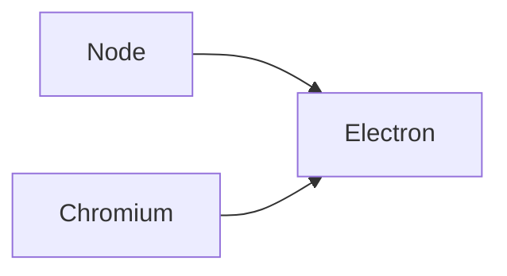

[Electron](https://electron.atom.io/)是一套結合了Chromium瀏覽器與Node.js功能，能使用網頁相關技術撰寫桌面應用的框架。



Electron 除了使用網頁當作應用程式介面，像一般桌面應用一樣離線可使用之外，開發者可以使用npm上的各種node module來加快開發速度。

諸如存取檔案，標題列（Task bar），桌面圖示（Dock icons），系統通知（Notification），選單，快捷鍵等作業系統的原生功能，Electron 也都有支援，可以用來製作大部分的應用程式。

目前許多人使用的[atom](https://atom.io/)與[Visual Studio Code](https://code.visualstudio.com/)編輯器，都是基於Electron製作的。事實上Electron就是Github在開發atom編輯器的過程中產生的專案。

## 使用Electron

安裝Electron已經變得相當簡單

```sh
$ electron-prebuilt
```

使用以下命令執行

```sh
electron .
```

或是直接下載官方提供的[electron-quick-start](https://github.com/electron/electron-quick-start)樣板來開始使用。

## Electron 的問題

Electron 對網頁開發人員來說相當友好，但封裝後檔案較大。使用者介面由於是使用網頁技術製作，往往和系統原生介面不一致，在選擇時要注意。
